# Xovis SDK

<div align="center">

| **Core SDK** | **Integrations** | **Agentic Layer** |
|:---:|:---:|:---:|
| [](https://pypi.org/project/xovis-sdk/1.0.0a24/) | [](https://openai.com/) | [](https://modelcontextprotocol.io/) |
| [](https://www.npmjs.com/package/xovis-sdk/v/1.0.0-a24) | [](https://www.anthropic.com/) | [](https://langchain.com/) |
| [](https://github.com/xovis-open-sdk/xovis-sdk) | [](https://smithery.ai/servers/xovis-sdk/xovis-mcp) | [](https://crewai.com/) |
| [](https://opensource.org/licenses/MIT) | [](https://smithery.ai/servers/xovis-sdk/xovis-mcp) | [](https://cursor.sh/) |

</div>

An enterprise-grade integration SDK for Xovis 3D Sensors and the Xovis HUB Cloud infrastructure.

**[Read the Full Documentation Website →](https://xovis-open-sdk.github.io/xovis-sdk/)**

> **Compliance Note:** This project is an independent, open-source initiative. It is not officially affiliated with, maintained by, or endorsed by Xovis AG.

---

## ⚠️ Xovis HUB Cloud Compatibility & Rate Limits

This SDK is architected for enterprise-scale fleet orchestration. Due to the high concurrency of the `HubClient` and `bulk_execute` methods, a **Xovis HUB Pro** subscription is strongly suggested by the development team. Operating the SDK on the free tier may result in aggressive HTTP 429 Rate Limit exhaustion, which will disrupt automated provisioning and telemetry pipelines.

---

## Overview

Integrating native Xovis DataPush protocols and REST APIs into enterprise data pipelines typically requires substantial boilerplate, complex state management, and strict network handling to maintain real-time DataPush ingestion (up to 12.5Hz). 

This SDK abstracts the complexities of the Xovis hardware into a unified, modern, and type-safe "Universal Translator" architecture. It completely decouples raw edge telemetry from downstream infrastructure, enabling engineers to focus strictly on spatial analytics, fleet orchestration, and data warehousing.

### System Data Flow

```mermaid
graph TB
    subgraph "Xovis Hardware Layer"
        direction TB
        A[Physical Sensors / Spiders]
        H[Xovis HUB Cloud]
        H -- Secure Proxy Tunnel (M2M) --> A
    end

    subgraph "Data Plane (High Frequency)"
        B[XovisTCPServer / XovisUDPServer / XovisHTTPServer]
        S[XovisSink]
    end

    subgraph "Control & State Plane (SDK Core)"
        C[DeviceClient]
        F[HubClient]
        D[HostStateBucket / ConfigCache]
        
        F -- "connect_device()" --> C
        C <--> D
    end

    subgraph "Agentic & Tooling Layer"
        G[XovisAIToolkit]
        M[MCP Server / Model Context Protocol]
        R[REPLAccessor / CLI]
    end

    %% Data Connections
    A -->|Live-Push up to 12.5Hz| B
    B -->|Sliding Buffer Extraction| S

    %% Control Connections
    A <-->|Local REST API v5| C
    H <-->|Hub REST API| F
    
    %% Fleet Integration
    D -. "Reflect State" .-> R
    F -. "Fleet Sync" .-> D

    %% AI Integration
    D --- G
    F --- G
    G --- M
    M --- LLM[LLM / Autonomous Agents]

    %% Styling
    style A fill:#1e293b,stroke:#38bdf8,stroke-width:2px
    style H fill:#1e293b,stroke:#38bdf8,stroke-width:2px
    style B fill:#0f172a,stroke:#2dd4bf,stroke-width:2px
    style C fill:#0f172a,stroke:#2dd4bf,stroke-width:2px
    style F fill:#0f172a,stroke:#2dd4bf,stroke-width:2px
    style G fill:#1e293b,stroke:#818cf8,stroke-width:2px
    style M fill:#1e293b,stroke:#818cf8,stroke-width:2px
```



---

## Architectural Pillars

The SDK is strictly quadrifurcated into four distinct planes to prevent blocking the asynchronous event loop during high-frequency operations while enabling autonomous systems:

1.  **The Data Plane (Telemetry Ingestion):** A zero-copy, lock-free telemetry ingestion engine supporting high-frequency **Live-Push (up to 12.5Hz)** coordinates and minutely **Logic-Push** events over TCP, UDP, and HTTP.
    Read the [Data Plane Documentation](docs/architecture/data_plane.md)
2.  **The Control Plane (Configuration):** A resilient, asynchronous HTTP engine wrapping the Xovis Edge and HUB APIs with strict Pydantic V2 schema validation and automatic Auth0 token lifecycles.
    Read the [Control Plane Documentation](docs/architecture/control_plane.md)
3.  **The Topology & State Plane (Fleet Orchestration):** A memory-efficient graph engine modelling complex multisensor parent/child relations with an offline-first **Native State Bucket**.
    Read the [State & Topology Documentation](docs/architecture/state_topology.md)
4.  **The Agentic Layer (AI Orchestration):** A Universal Tool Adapter and Model Context Protocol (MCP) server that grants autonomous orchestration capabilities to modern AI frameworks and LLMs.
    Read the [Agentic Layer Documentation](docs/architecture/agentic_layer.md)

---

## Quick Start

### Installation

```bash
# Install the core SDK with testing and development utilities
pip install "xovis-sdk[test]"
```

### Unified Hybrid Routing

Interact natively with hardware topologies using the **UnifiedDeviceClient**. It automatically performs a fast TCP/HTTP probe of local IP addresses (direct LAN execution), falls back to a secure connection routed through the Cloud HUB proxy tunnel (`HubClient.connect_device`) if remote, and resolves names dynamically.

```python
from xovis import UnifiedDeviceClient

async def run():
    # Automatically routes to direct LAN, HUB proxy tunnel, or resolves name
    async with UnifiedDeviceClient("00:26:8c:12:34:56", host="10.0.0.50") as device:
        if await device.has_analytics:
            # Simple, dot-notation collection accessors
            zone = device.cache.zones.by_name.Main_Entrance
            print(f"Discovered zone ID: {zone.id}")
```

Explore more examples in the [Full Documentation Website](https://xovis-open-sdk.github.io/xovis-sdk/).

---

## Model Context Protocol (MCP)

The Xovis SDK includes a first-class MCP server, allowing AI agents (like Claude Desktop and Cursor) to directly orchestrate hardware.

**Quick Install with Smithery:**

```bash
npx -y smithery install xovis-sdk
```

See the complete [MCP Guide](docs/ai/mcp.md) and [AI Safety & Guardrails](docs/ai/safety_guardrails.md) for more details.

---

## Developer Experience & CLI

The SDK includes a native CLI tool to extract topology data from an offline sensor cache, generating strict Python `Literal` types for perfect IDE autocompletion, alongside a complete Mission Control terminal UI.

```bash
# Generate static types
xovis-cli generate-types --source ./device_state.json

# Launch Xovis Open SDK Mission Control TUI
xovis-cli ui
```

---

## Enterprise Testing & Contribution

The `xovis-sdk` adheres to the absolute highest tier of enterprise SDET standards, utilizing a 4-Tier test matrix with strict idempotency and hard teardown boundaries.

To contribute, please refer to our [Engineering Guidelines](docs/contributing/engineering_guidelines.md) and ensure all checks pass before submitting a PR.
