# Xovis SDK

<div align="center">

| **Core SDK** | **Integrations** | **Agentic Layer** |
|:---:|:---:|:---:|
| [](https://pypi.org/project/xovis-sdk/1.0.0a18/) | [](https://openai.com/) | [](https://modelcontextprotocol.io/) |
| [](https://badge.fury.io/js/xovis-sdk) | [](https://www.anthropic.com/) | [](https://langchain.com/) |
| [](https://github.com/xovis-open-sdk/xovis-sdk) | [](https://smithery.ai/servers/xovis-sdk/xovis-mcp) | [](https://crewai.com/) |
| [](https://opensource.org/licenses/MIT) | [](https://smithery.ai/servers/xovis-sdk/xovis-mcp) | [](https://cursor.sh/) |

</div>

An enterprise-grade integration SDK for Xovis 3D Sensors and the Xovis HUB Cloud infrastructure.

**[Read the Full Documentation →](https://xovis-open-sdk.github.io/xovis-sdk/)**

**Compliance Note:** This project is an independent, open-source initiative. It is not officially affiliated with, maintained by, or endorsed by Xovis AG.

---

## ⚠️ Xovis HUB Cloud Compatibility & Rate Limits

This SDK is architected for enterprise-scale fleet orchestration. Due to the high concurrency of the `HubClient` and `bulk_execute` methods, a **Xovis HUB Pro** subscription is strongly suggested by the development team. Operating the SDK on the free tier may result in aggressive HTTP 429 Rate Limit exhaustion, which will disrupt automated provisioning and telemetry pipelines.

---

## Overview

Integrating native Xovis DataPush protocols and REST APIs into enterprise data pipelines typically requires substantial boilerplate, complex state management, and strict network handling to maintain real-time DataPush ingestion (up to 12.5Hz). 

This SDK abstracts the complexities of the Xovis hardware into a unified, modern, and type-safe "Universal Translator" architecture. It completely decouples raw edge telemetry from downstream infrastructure, enabling engineers to focus strictly on spatial analytics, fleet orchestration, and data warehousing.

### System Data Flow

```mermaid
graph TB
    subgraph "Xovis Hardware Layer"
        direction TB
        A[Physical Sensors / Spiders]
        H[Xovis HUB Cloud]
        H -- Secure Proxy Tunnel (M2M) --> A
    end

    subgraph "Data Plane (High Frequency)"
        B[XovisTCPServer / XovisUDPServer / XovisHTTPServer]
        S[XovisSink]
    end

    subgraph "Control & State Plane (SDK Core)"
        C[DeviceClient]
        F[HubClient]
        D[HostStateBucket / ConfigCache]
        
        F -- "connect_device()" --> C
        C <--> D
    end

    subgraph "Agentic & Tooling Layer"
        G[XovisAIToolkit]
        M[MCP Server / Model Context Protocol]
        R[REPLAccessor / CLI]
    end

    %% Data Connections
    A -->|Live-Push up to 12.5Hz| B
    B -->|Sliding Buffer Extraction| S

    %% Control Connections
    A <-->|Local REST API v5| C
    H <-->|Hub REST API| F
    
    %% Fleet Integration
    D -. "Reflect State" .-> R
    F -. "Fleet Sync" .-> D

    %% AI Integration
    D --- G
    F --- G
    G --- M
    M --- LLM[LLM / Autonomous Agents]

    %% Styling
    style A fill:#1e293b,stroke:#38bdf8,stroke-width:2px
    style H fill:#1e293b,stroke:#38bdf8,stroke-width:2px
    style B fill:#0f172a,stroke:#2dd4bf,stroke-width:2px
    style C fill:#0f172a,stroke:#2dd4bf,stroke-width:2px
    style F fill:#0f172a,stroke:#2dd4bf,stroke-width:2px
    style G fill:#1e293b,stroke:#818cf8,stroke-width:2px
    style M fill:#1e293b,stroke:#818cf8,stroke-width:2px
```



## Architectural Pillars

The SDK is strictly quadrifurcated to prevent blocking the asynchronous Python event loop during high-frequency operations while enabling autonomous systems:

1. **The Data Plane:** A zero-copy, lock-free telemetry ingestion engine. Bypasses standard JSON validation in the hot path, converting edge data (TCP, UDP Datagrams, and HTTP Webhooks) directly into optimized structures for downstream sinks. Supports **Live-Push (up to 12.5Hz)** coordinates and minutely **Logic-Push** events.
2. **The Control Plane:** A resilient, asynchronous HTTP engine wrapping the Xovis Edge and HUB APIs. It implements a version-agnostic **Manual Bridge Layer** that abstracts firmware-specific JSON variations into stable SDK properties. Supports complex Custom Logic (RPN filters, age histograms), spatial entities (Lines, Masks, Blocked Spaces), core business logic (Logics, Layers, ObjectTypes), high-frequency DataPush pipelines (Agents, Connections, manual triggers), automated OAuth2 token lifecycles, proactive hardware capability probing, intelligent error mapping for hardware-level restrictions (HTTP 403), and strict Pydantic V2 schema enforcement.
3. **The Topology & State Plane:** A memory-efficient graph engine. It models complex multisensor parent-/child relations and provides an **offline-first Native State Bucket**. It features **Firmware Autonomy** via a passive discovery crawler that identifies unknown hardware API fields during synchronization, ensuring the "Universal Translator" remains compatible with new releases.
4. **The Agentic Layer (AI Toolkit):** A Universal Tool Adapter leveraging Pydantic V2 to expose SDK methods as strictly validated JSON schemas or asynchronous callable primitives. This grants autonomous orchestration capabilities to modern AI frameworks and LLMs natively. Includes the **Native Bucket Memory Plane** for zero-latency hardware observation.

## Core Capabilities & API Preview

### 1. Fleet Orchestration (Cloud Hub)

Execute resilient, concurrent operations across an entire filtered fleet utilizing secure Xovis HUB Cloud tunnels with built-in fault isolation.

```python
from xovis.api.hub.client import HubClient

async def update_timezone(device):
    """Callback function mapped across the fleet."""
    return await device.time.update({"time_zone": "Europe/Zurich"})

async def main():
    target_filter = {"customerName": "RetailCorp", "categories": ["Region-DACH"]}

    async with HubClient(client_id="...", client_secret="...", fleet_filter=target_filter) as hub:
        results = await hub.bulk_execute(update_timezone)
        
        for mac, result in results.items():
            if isinstance(result, Exception):
                print(f"Failed on {mac}: {result}")

```

### 2. Topology-Aware Edge Configuration (Offline-First)

Interact natively with hardware topologies using the **Native State Bucket**. The SDK automatically distinguishes between physical lenses (`singlesensor`) and virtual stitched environments (`multisensors`), resolving human-readable names to internal IDs via a zero-network-penalty cache.

**DX:** Every collection (agents, logics, geometries, etc.) features a `.by_name` accessor for instant dot-notation discovery and IDE autosuggestions, eliminating the need for brittle ID management.

#### Offline-First Persistence
The SDK features a non-blocking configuration cache that can be persisted to disk to enable instant "Cold Starts" and resilience against temporary network failures.

*   **Explicit:** `auto_persist_path="./state.json"` (Single file)
*   **Managed:** `persistence_dir="./states/"` (Auto-organized by MAC address)

```python
from xovis.api.device.client import DeviceClient
from xovis.models.device_auto import SceneGeometry

async def configure_edge():
    # Cache Watcher and auto-persistence initiate securely in the background
    # Note: Default username is "admin"
    async with DeviceClient("10.0.0.50", "admin", "password", auto_persist_path="./state.json") as device:
        
        # Proactive hardware capability probing prevents silent exceptions
        if await device.has_analytics:
            # DOT-NOTATION DISCOVERY: The cache resolves the human-readable "Main Entrance" instantly
            # All resources (agents, connections, logics, zones) are exposed via .by_name
            zone = device.cache.zones.by_name.Main_Entrance
            
            # Discovery also works for state buckets (contexts) via .buckets
            # This provides full IDE autosuggestion for physical and virtual environments
            ss = device.cache.buckets.singlesensor
            
            # Operations scale seamlessly to complex multisensor graphs
            terminal_b = device.cache.multisensors.by_name.Terminal_B
            await terminal_b.analytics.delete_logic("Legacy Count")

        # Access historical counts for auditing
        # XovisTime supports relative ('-1d'), ISO 8601 (with offsets), and datetime objects
        history = await device.singlesensor.history.get_counts(
            start_time="-1d", end_time="now", resolution="60"
        )

```

### 3. High-Frequency Telemetry Ingestion

Deploy lock-free receiver pipelines that ingest and offload raw spatial coordinates without bottlenecking the Python event loop. The SDK natively supports `XovisTCPServer`, `XovisHTTPServer` (Webhooks), and `XovisUDPServer` (Datagrams), exposing a clean `XovisSink` protocol for proprietary downstream integration.

```python
from xovis.datapush.tcp_server import XovisTCPServer
from xovis.datapush.sinks import XovisSink


class StandardOutputSink(XovisSink):
    """Custom implementation for processing edge data datapush."""

    async def on_frame(self, frame: dict) -> None:
        # Process ingested frame here
        print(f"Ingested frame with {len(frame.get('tracked_objects', []))} objects.")

    async def on_events(self, events: list) -> None:
        pass


async def start_telemetry():
    server = XovisTCPServer(host="0.0.0.0", port=49156)

    # Attach your custom downstream processor
    server.attach_sink(StandardOutputSink())

    await server.start()

```
### 4. Autonomous AI Orchestration (Agentic Layer)

Transform the physical hardware into an AI-controllable node. The SDK provides the most sophisticated AI integration in the market:
*   **Universal Tool Adapter**: A dynamic reflection engine that crawls SDK managers at runtime, projecting Google-style docstrings and Pydantic V2 schemas for OpenAI, Anthropic, LangChain, and CrewAI.
*   **Model Context Protocol (MCP)**: Standardized bridge for desktop agents like Claude and Cursor.
*   **Native Bucket Memory Plane**: State-of-the-art compression algorithm using the offline-first bucket to reduce context window tokens by up to 40% for massive fleet observation.
*   **Safety Guardrails**: Enterprise-grade "Immune System" with hardcoded safety policies (BLOCKED, CRITICAL, RESTRICTED) and explicit confirmation signatures.
*   **Privacy & Pseudonymization**: The **AI Privacy Engine** (`AIPrivacySession`) implements two-way pseudonymization for automatic data scrubbing, ensuring the LLM only interacts with session-bound hashes while the toolkit restores real identifiers (MACs, Names) during execution.
*   **WAF & Privacy Blocks**: Built-in handling for `HTTP 403` HTML responses, identifying when requests are blocked by the Xovis HUB, Sensor, Spider, or Privacy Mode (Modes 3 & 4).
*   **Resource Aggregation**: Intelligent context-awareness that automatically aggregates analytics, spatial telemetry (`aggregate_heat_map`, `aggregate_height_map`), geometries, and history across all `active_contexts`.
*   **Adaptive Pacing Engine**: Built-in congestion control that adjusts request delays (0.2s for LAN, 1.0s for Cloud) to respect rate limits and prevent hardware saturation.
*   **AI Safety TUI**: A dedicated management interface (`xovis-cli gui`) for configuring granular field-level privacy toggles and persistent tool-to-safety-level mappings.
*   **Strict Concurrency & Scalability**: Enforced 350-device threshold for State Buckets and Agent Authorization Scopes for zero-trust fleet isolation.

```python
import json
from xovis.api.device.client import DeviceClient
from xovis.api.hub.client import HubClient
from xovis.skills.toolkit import XovisAIToolkit, XovisAgentMemory

async def autonomous_agent():
    # 1. Edge-Level Orchestration
    async with DeviceClient("10.0.0.50", "admin", "password") as device:
        # Native Bucket Memory provides zero-latency context with 40% better token efficiency
        memory = XovisAgentMemory(device.cache._state)
        context = memory.get_compressed_state()

        toolkit = XovisAIToolkit(device)
        
        # Seamlessly inject Xovis capabilities into GPT-5.5
        response = await openai.chat.completions.create(
            model="gpt-5.5",
            messages=[
                {"role": "system", "content": f"Current Device State: {context}"},
                {"role": "user", "content": "Reboot the sensor."}
            ],
            tools=toolkit.get_openai_tools()
        )

    # 2. Fleet-Level Orchestration
    async with HubClient(client_id="...", client_secret="...") as hub:
        fleet_toolkit = XovisAIToolkit(hub)
        
        # Execute fleet-wide operations with a single LLM tool call
        # The adaptive pacing (1.0s) ensures we don't saturate the Cloud HUB tunnel
        await fleet_toolkit.execute_tool("fleet_reboot", {"confirmation": True})

```

### Model Context Protocol (MCP)

The Xovis SDK includes a first-class MCP server, allowing AI agents (like Claude Desktop and Cursor) to directly orchestrate hardware.

**Quick Install with Smithery:**
[](https://smithery.ai/server/xovis-sdk)

Alternatively, install manually: `npx -y smithery install xovis-sdk`

## Developer Experience & Type Safety (CLI)

The SDK is designed for maximum developer ergonomics. It includes a native CLI tool to extract topology data from an offline sensor cache, generating strict Python `Literal` types for perfect IDE autocompletion.

Features include zero-dependency ANSI color outputs, generation analytics ("the receipt"), `--dry-run` safety, dynamic path resolution, and native `ruff` formatting integration.

```bash
# Generate static types
xovis-cli generate-types --source ./device_state.json

# Launch Xovis Open SDK Mission Control TUI
xovis-cli ui

# Launch Xovis Open SDK Datapush Studio TUI
xovis-cli datapush --protocol TCP --port 9000
```

## Enterprise Testing & Contribution

We welcome contributions from systems engineers and data scientists. The `xovis-sdk` adheres to the absolute highest tier of enterprise SDET standards:

1. **The 4-Tier SDET Matrix:** The SDK is guarded by a comprehensive Software Development Engineer in Test (SDET) suite, strictly isolated into Smoke (Stateless - including `XovisTime` normalization), Stateful Configuration (CRUD - consolidated Tier 2), Data Plane (High-Frequency), and Endurance/Integrity (Validation).
2. **Strict Idempotency:** All E2E hardware tests (`@pytest.mark.destructive`) execute a pre-flight state sweep and guarantee a hard teardown via strict `try...finally` boundaries to prevent physical hardware exhaustion.
3. **Clean Code Philosophy (Zero-Comment, Max-Docstring):** The codebase strictly prohibits inline developer chatter. Architectural intent, Pydantic constraints, and plane boundaries are formalized exclusively through rigorous Google-style docstrings.

Please ensure all PRs pass the GitHub Actions CI pipeline (`ruff format`, `ruff check`, and `-m "not destructive"`) before requesting a review.
