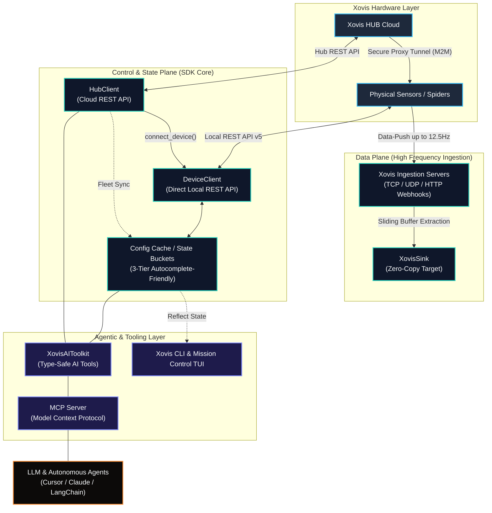

# Xovis SDK

<div align="center">

| **Core SDK** | **Integrations** | **Agentic Layer** |
|:---:|:---:|:---:|
| [](https://pypi.org/project/xovis-sdk/1.0.0a27/) | [](https://openai.com/) | [](https://modelcontextprotocol.io/) |
| [](https://www.npmjs.com/package/xovis-sdk/v/1.0.0-a27/) | [](https://www.anthropic.com/) | [](https://langchain.com/) |
| [](https://github.com/xovis-open-sdk/xovis-sdk) | [](https://smithery.ai/servers/xovis-sdk/xovis-mcp) | [](https://crewai.com/) |
| [](https://opensource.org/licenses/MIT) | [](https://smithery.ai/server/xovis-sdk) | [](https://cursor.sh/) |

</div>

An enterprise-grade integration SDK for Xovis 3D Sensors and the Xovis HUB Cloud infrastructure.

**[Read the Full Documentation Website →](https://xovis-open-sdk.github.io/xovis-sdk/)**

> **Compliance Note:** This project is an independent, open-source initiative. It is not officially affiliated with, maintained by, or endorsed by Xovis AG.

---

## ⚠️ Xovis HUB Cloud Compatibility & Rate Limits

This SDK is architected for enterprise-scale fleet orchestration. Due to the high concurrency of the `HubClient` and `bulk_execute` methods, a **Xovis HUB Pro** subscription is strongly suggested by the development team. Operating the SDK on the free tier may result in aggressive HTTP 429 Rate Limit exhaustion, which will disrupt automated provisioning and telemetry pipelines.

---

## Overview

Integrating native Xovis DataPush protocols and REST APIs into enterprise data pipelines typically requires substantial boilerplate, complex state management, and strict network handling to maintain real-time DataPush ingestion (up to 12.5Hz).

This SDK abstracts the complexities of the Xovis hardware into a unified, modern, and type-safe "Universal Translator" architecture. It completely decouples raw edge telemetry from downstream infrastructure, enabling engineers to focus strictly on spatial analytics, fleet orchestration, and data warehousing.

### System Data Flow



---

## Architectural Pillars

The SDK is strictly quadrifurcated into four distinct planes to prevent blocking the asynchronous event loop during high-frequency operations while enabling autonomous systems:

1. **The Data Plane (Telemetry Ingestion):** A zero-copy, lock-free telemetry ingestion engine supporting high-frequency **Live-Push (up to 12.5Hz)** coordinates and minutely **Logic-Push** events over TCP, UDP, and HTTP.
   [Read the Data Plane Documentation](https://xovis-open-sdk.github.io/xovis-sdk/architecture/data_plane/)
2. **The Control Plane (Configuration):** A resilient, asynchronous HTTP engine wrapping the Xovis Edge and HUB APIs with strict Pydantic V2 schema validation and automatic Auth0 token lifecycles.
   [Read the Control Plane Documentation](https://xovis-open-sdk.github.io/xovis-sdk/architecture/control_plane/)
3. **The Topology & State Plane (Fleet Orchestration):** A memory-efficient graph engine modelling complex multisensor parent/child relations with an offline-first **Native State Bucket**.
   [Read the State & Topology Documentation](https://xovis-open-sdk.github.io/xovis-sdk/architecture/state_topology/)
4. **The Agentic Layer (AI Orchestration):** A Universal Tool Adapter and Model Context Protocol (MCP) server that grants autonomous orchestration capabilities to modern AI frameworks and LLMs.
   [Read the Agentic Layer Documentation](https://xovis-open-sdk.github.io/xovis-sdk/architecture/agentic_layer/)

---

## Why this SDK?

| Integration Challenge | The Traditional Way | The `xovis-sdk` Way |
| :--- | :--- | :--- |
| **Telemetry Ingestion** | Writing heavy boilerplate socket listeners, manual parsing, and managing high-frequency (12.5Hz) packet buffers. | Production-ready, zero-copy `XovisTCPServer` / `XovisUDPServer` that stream frames concurrently without blocking the event loop. |
| **Mixed-Fleet Operations** | Multi-device file name clashes, version flapping, and cache-overwriting races on networks with heterogeneous firmware versions. | Category-scoped, version-isolated storage inside `_local_resources/` keeping schemas and topology states completely decoupled. |
| **Path Traversal & Routing** | Manually probing LAN hosts, checking availability, juggling ports, and resolving proxy tunnels to reach remote sensors. | Automatic hybrid network probing via `UnifiedDeviceClient` which resolves direct LAN, VPN, and secure HUB cloud-proxy tunnels. |
| **State Persistence** | Silently failing or throwing hard errors when running in read-only environments (e.g., Docker, AWS Lambda) without writable workspaces. | Resilient **3-Tier Caching System** automatically trying Local CWD workspace, falling back to System Cache, and defaulting to RAM-only. |
| **Multisensor Topologies** | Complex recursive queries to map master Spider controllers, stitched sensor contexts, and child lens hierarchies. | Dynamic `child_devices` & `child_caches` accessors with merged bulk collection aggregation and concurrent group broadcasting facades. |
| **API Code Autocompletion** | Parsing raw JSON/YAML payloads, navigating untyped dictionaries, and crashing on resource names containing spaces. | Regex-based dynamic namespace sanitization (dot-notation autocomplete) combined with raw name index bracket-notation fallback. |
| **AI Agent Orchestration** | Creating unsafe custom scripts or exposing raw, unvalidated hardware APIs to autonomous LLM reasoning loops. | Safe-by-design Model Context Protocol (MCP) server and `XovisAIToolkit` wrapping operations in strict security guardrails. |

---

## Progressive Coding Journey

Go from raw, high-speed physical data streaming to full stateful management and multisensor fleet orchestration in three progressive tiers:

#### Tier 1: Multi-Environment Discovery & 3-Tier Caching
Establish connectivity to your diverse fleet across local LAN, VPN, and secure Xovis HUB Cloud proxy tunnels. Automatically initialize the resilient 3-Tier Caching System to persist configuration states for offline autocomplete.

```python
import asyncio
from xovis import UnifiedDeviceClient, HubClient, CachePaths

async def main():
    # Connect via HUB to manage Local, VPN, and Cloud-Proxy Tunnel connections
    async with HubClient() as hub:
        # Unified clients automatically probe and resolve different connection paths
        device_lan = UnifiedDeviceClient(host="192.168.1.10")
        device_vpn = UnifiedDeviceClient(host="10.8.0.5")
        device_hub = UnifiedDeviceClient(mac_address="00:26:8c:12:34:56", hub_client=hub)
        
        # Concurrently synchronize and cache configurations for offline-first operations
        async with device_lan, device_vpn, device_hub:
            await asyncio.gather(
                device_lan.cache.sync(),
                device_vpn.cache.sync(),
                device_hub.cache.sync()
            )
            
            # Save the aggregated, autocomplete-friendly states to disk
            device_lan.cache.export_to_file(CachePaths.DEVICE_STATE)
            print(f"Successfully cached states in: {CachePaths.DEVICE_STATE}")

if __name__ == "__main__":
    asyncio.run(main())
```

#### Tier 2: Concurrent Multi-Sink Telemetry Ingestion & Port Offsetting
Prevent port collisions on multi-device networks. Load offline cache configurations via dot-notation, offset telemetry ports dynamically, spin up concurrent lock-free TCP/UDP ingestion servers, and activate live stream push agents.

```python
import asyncio
from xovis import UnifiedDeviceClient, XovisTCPServer, XovisSink

class CustomTelemetrySink(XovisSink):
    async def write(self, frame: dict) -> None:
        # Zero-copy, high-frequency stream processing (coordinates/people tracking)
        for person in frame.get("people", []):
            print(f"Tracking ID {person['id']} at ({person['x']}, {person['y']})")

async def main():
    # Spin up two non-blocking TCP telemetry ingestion servers concurrently
    server_1 = XovisTCPServer(port=9000, sink=CustomTelemetrySink())
    server_2 = XovisTCPServer(port=10000, sink=CustomTelemetrySink())
    await asyncio.gather(server_1.start(), server_2.start())
    
    # Connect to device, mutate local ports on the connection agent to prevent conflicts
    async with UnifiedDeviceClient(host="10.8.0.5") as device:
        await device.cache.load_from_disk()
        
        # Fetch configurations safely via autocomplete-friendly dot-notation
        conn = device.cache.connections.by_name.MainSink
        conn.port += 1000  # Offset port dynamically
        
        # Apply the connection payload and programmatically activate the telemetry stream
        await device.datapush.update_connection(conn.id, conn)
        await device.datapush.enable_agent("TelemetryAgent")
        print("Telemetry connection offset applied and agent live stream activated!")

if __name__ == "__main__":
    asyncio.run(main())
```

#### Tier 3: Stitched Multisensor Orchestration & Child Broadcasting
For master Spider NUCs or master PC/PF-series devices, automatically resolve the stitched multisensor topology. Concurrently synchronize child lens configurations, query merged child collections, and broadcast live tasks across all child nodes simultaneously.

```python
import asyncio
from xovis import UnifiedDeviceClient, HubClient

async def main():
    async with HubClient() as hub:
        # Connect to master Spider or PC sensor to traverse the stitched multisensor topology
        # Enable recursive child-device configuration caching with a simple flag
        async with UnifiedDeviceClient("00:26:8c:12:34:56", hub_client=hub, cache_child_devices=True) as master:
            await master.cache.sync()
            
            # 1. Retrieve the stitched multisensor context
            context = master.cache.multisensors.by_name.Stitched_Context
            print(f"Orchestrating stitched multisensor: {context.name}")
            
            # 2. Access merged child configurations across all physical child lenses (zero guesswork!)
            child_conn = context.child_devices.connections.by_name.my_child_connection
            print(f"Discovered merged child connection on port: {child_conn.port}")
            
            # 3. Broadcast live diagnostic actions concurrently across all child sensors in one go
            bulk_results = await context.child_devices.images.get_raw_left()
            print(f"Captured live diagnostic frames. Successes: {len(bulk_results.successes)}")

if __name__ == "__main__":
    asyncio.run(main())
```

[Read more about the state orchestration capabilities in the State & Topology Docs](https://xovis-open-sdk.github.io/xovis-sdk/architecture/state_topology/)

---

## Model Context Protocol (MCP)

The Xovis SDK includes a first-class MCP server, allowing AI agents (like Claude Desktop and Cursor) to directly orchestrate hardware.

**Quick Install with Smithery:**

```bash
npx -y smithery install xovis-sdk
```

See the complete [MCP Guide](https://xovis-open-sdk.github.io/xovis-sdk/ai/mcp/) and [AI Safety & Guardrails](https://xovis-open-sdk.github.io/xovis-sdk/ai/safety_guardrails/) for more details.

---

## Developer Experience & CLI

The SDK includes a native CLI tool to manage cache warmups, extract topology data from offline caches, generate strict Python types/Literals for perfect IDE autocompletion, alongside an interactive REPL accessor and a complete Mission Control terminal UI.

### Cache Warmup & Synchronize CLI
Populate your schema definitions and local configurations directly from the terminal:

```bash
# Warm up local device config/schemas (automatically downloads OpenAPI + DataPush JSON schemas)
xovis-cli warmup 192.168.1.10 --user admin --pass secret_pass

# Warm up entire cloud fleet state and cloud schemas from Xovis HUB
xovis-cli warmup-hub --client-id MY_ID --client-secret MY_SECRET

# Generate static types from local state cache files for perfect autocomplete
xovis-cli generate-types --source ./_local_resources/states/device_state.json

# Launch Xovis Open SDK Mission Control TUI
xovis-cli ui
```

### Interactive REPL Explorer
Expose your physical sensor fleets directly within interactive IPython, Jupyter Notebooks, or a standard Python REPL shell. The `REPLAccessor` normalized collections bypass strict validation locks for instant object-attribute discovery:

```python
>>> from xovis import UnifiedDeviceClient
>>> device = UnifiedDeviceClient("10.8.0.5")
>>> await device.cache.load_from_disk()

# Dynamic dot-notation autocompletion with regex-sanitized names
>>> device.cache.zones.by_name.Main_Entrance
<Zone id="1" name="Main Entrance">

# Seamless list-indexing with raw names containing spaces or characters
>>> device.cache.zones["Main Entrance"]
<Zone id="1" name="Main Entrance">
```

---

## Enterprise Testing & Contribution

The `xovis-sdk` adheres to the absolute highest tier of enterprise SDET standards, utilizing a 4-Tier test matrix with strict idempotency and hard teardown boundaries.

To contribute, please refer to our [Engineering Guidelines](https://xovis-open-sdk.github.io/xovis-sdk/contributing/engineering_guidelines/) and ensure all checks pass before submitting a PR.
