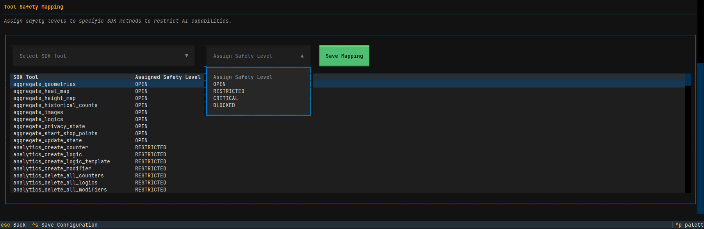
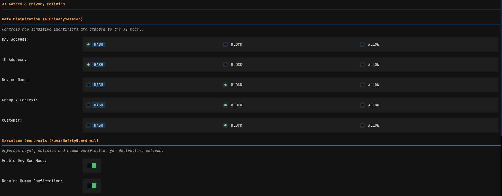
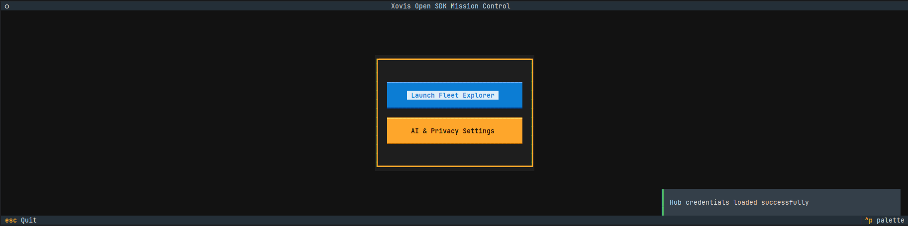
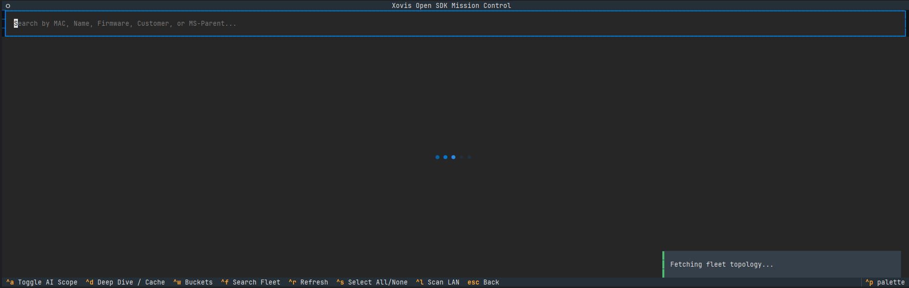

# Agentic Layer (Skills)

| **Status** | **Discovery** | **Installation** |
| :---: | :---: | :---: |
| [](https://smithery.ai/server/xovis-sdk) | [](https://modelcontextprotocol.io/) | [](https://smithery.ai/server/xovis-sdk) |

| **Compatibility** | **Frameworks** | **Optimized For** |
| :---: | :---: | :---: |
| [](https://openai.com/) | [](https://langchain.com/) | [](https://cursor.sh/) |
| [](https://www.anthropic.com/) | [](https://crewai.com/) | |

The `xovis.skills` module is the definitive **Agentic Layer** of the Xovis SDK. It modernizes hardware orchestration by transforming physical edge sensors and Cloud HUB fleet operations into standardized, strictly validated toolsets for Large Language Models (LLMs) and autonomous agent frameworks.

!!! info "Advanced Integration"
    If you are building complex agentic systems or need to understand the deep technical rules for tool-calling and safety, refer to the [Detailed Agent Instructions](../contributing/agent_instructions.md).

## Architectural Intent

In the current state-of-the-art landscape, hardware nodes are no longer passive targets for scripts; they are intelligent participants in autonomous ecosystems. This module provides the "Universal Translator" required to bridge the gap between low-level Universal Translator SDK logic and high-level business logic AI reasoning loops.

### Architectural Pillars:

1.  **Universal Tool Adapter (`XovisAIToolkit`)**: A dynamic reflection engine that crawls SDK managers at runtime, projecting Google-style docstrings and Pydantic V2 schemas for OpenAI, Anthropic, and LangGraph.
2.  **The Agentic Memory Plane (`XovisAgentMemory`)**: A high-density, zero-latency observation window. It provides agents with minified hardware state snapshots, eliminating the network penalty of redundant polling.
3.  **Fleet-Scale Orchestration (`XovisFleetToolkit`)**: Exposes resilient, concurrent `bulk_execute` operations as atomic tools for managing thousands of sensors via a single reasoning context.
4.  **Adaptive Pacing Engine**: Built-in congestion control that automatically adjusts request delays (0.2s for LAN, 1.0s for Cloud) to respect WAF limits and prevent hardware saturation.
5.  **Framework Interoperability (`LangChain Adapter`)**: Bridges the SDK's native toolkit with the LangChain ecosystem, enabling seamless integration into LangGraph cyclic reasoning loops.

## Components & Capabilities

### 1. XovisAIToolkit (Universal Adapter)
The primary entry point for both single-device and fleet-wide orchestration. It manages the complex routing of LLM tool requests to the underlying asynchronous SDK managers.

*   **Dynamic Reflection Engine**: Crawls SDK managers at runtime using `inspect`, generating high-fidelity Pydantic schemas from Google-style docstrings and coroutine signatures.
*   **OpenAI GPT-4o Optimized**: Generates strict JSON schemas via `get_openai_tools()`.
*   **Latest Anthropic Models Ready**: Provides the flat `input_schema` format required by the Messages API via `get_anthropic_tools()`.
*   **Callable Primitives**: Exports direct references to async functions and their validation models for **LangGraph**, **CrewAI**, and **Cursor/Windsurf**.

### 2. XovisAgentMemory (State Observation)
Autonomous agents require environmental context without the 12.5Hz network overhead. By wrapping the `HostStateBucket`, this plane allows for the injection of minified, JSON-serialized hardware "memories" directly into the System Prompt.

### 3. XovisFleetToolkit (Distributed Management)
A specialized orchestrator for `HubClient` contexts. It exposes high-impact tools such as `fleet_reboot` and `get_fleet_summary`, enabling an agent to supervise entire global deployments with fault isolation.

### 4. LangChain & Multi-Agent Adapters
Bridges the SDK's native toolkit with modern agent frameworks.
*   **LangChain**: Native `StructuredTools` for LangGraph reasoning loops.
*   **CrewAI / AutoGPT**: Dedicated adapters providing `BaseTool` abstractions for multi-agent coordination.

## Integration & Implementation

### LLM Provider Support Matrix

| Provider | Method | Format |
| :--- | :--- | :--- |
| **OpenAI** | `get_openai_tools()` | Nested `{"type": "function", ...}` |
| **Anthropic** | `get_anthropic_tools()` | Flat `{"name", "description", "input_schema"}` |
| **LangChain** | `get_langchain_tools()` | List of `StructuredTool` objects |
| **CrewAI** | `get_crewai_tools()` | List of `BaseTool` objects |
| **LangGraph** | `get_callable_tools()` | List of `{"name", "callable", "args_model"}` |
| **Cursor / IDEs**| `get_callable_tools()` | Direct function primitives |

### 5. Token-Optimized Memory
The `XovisAgentMemory.get_compressed_state()` method implements a state-of-the-art compression algorithm that strips empty collections and default hardware values, reducing context window tokens by up to 40% for massive fleet summaries.

### Safety & Guardrails
The Agentic Layer includes an enterprise-grade safety engine to prevent hallucination-driven outages and accidental fleet destruction.


Figure: AI Tool Safety configuration in the Xovis Open SDK Mission Control.

*   **Safety Levels**: Every tool is assigned a `SafetyLevel` (`OPEN`, `RESTRICTED`, `CRITICAL`, `BLOCKED`).
    *   **OPEN**: Read-only observation tools (e.g., `get_system_info`, `get_topology_graph`, `aggregate_geometries`).
    *   **RESTRICTED**: Operations causing temporary disruption (e.g., `reboot_device`, `delete_all_geometries`). Enforces a warning and programmatic delay.
    *   **CRITICAL**: Destructive operations (e.g., `factory_reset`, `update_network_settings`, `clear_sensor_db`). Requires explicit Human-in-the-Loop (HITL) confirmation.
    *   **BLOCKED**: Hardcoded forbidden endpoints (e.g., `flash_format`, `reboot_rescue`) to prevent hardware damage.
*   **Enterprise Safety Policy**: Implements hardcoded overrides for high-risk operations, ensuring safety logic is robust against dynamic discovery heuristics.
*   **AI Privacy Engine**: A stateful, two-way pseudonymization system via `AIPrivacySession`. It replaces sensitive identifiers (MAC addresses, Customer names) with session-bound hashes (e.g., `Id_a1b2c3d4`). The AI only ever sees and interacts with these hashes, and the toolkit "restores" the real values only at the moment of execution. This ensures zero-trust data handling.
*   **Adaptive Pacing**: Intra-context aggregation loops automatically inject delays (1.0s for Cloud, 0.2s for LAN) to prevent Cloud HUB WAF triggers and sensor OOM crashes. Aggregation loops iterating over `active_contexts` via a `HubClient` MUST include an `asyncio.sleep(1.0)` delay after each request.

*   **AI Safety TUI**: Users can configure granular field-level privacy (HASH/BLOCK/ALLOW) and persistent tool-to-safety mappings via the built-in management screen.


Figure: AI Privacy and Tool Safety management screen.

*   **WAF & Privacy Blocks (HTTP 403)**: The toolkit intelligently detects `HTTP 403 Forbidden` errors that return raw HTML. These are reported as access restrictions by the Xovis HUB Web Application Firewall (WAF) or Edge Privacy Mode, preventing the agent from hallucinating data.
    *   *Agent Reporting Rule*: If an agent encounters an HTML 403 error, it must explicitly document: *"Access Restricted: Cloud Proxy Firewall or Strict Privacy Mode is blocking data extraction."*
*   **Strict Concurrency Limits**: Enforces a 350-device threshold for high-intensity fleet state operations (State Buckets / Deep Dives) to prevent hardware-side rate-limiting.
*   **Mandatory Confirmation**: High-impact operations (e.g., `reboot_fleet`) require an explicit `confirmation=True` argument from the LLM.
*   **Execution Quotas**: Limits the number of `CRITICAL` operations allowed per session (default: 3).
*   **Dynamic Restricted Tools**: Allows users to manually elevate ANY tool to `CRITICAL` or `BLOCKED` status via the `restricted_tools` dictionary.
*   **Dry Run Mode**: Allows for safe agent training by intercepting and simulating hardware-modifying commands.

#### AI Scope (Fleet Whitelist)
Autonomous agents can be further restricted by whitelisting specific sensors in the **Fleet Explorer**. Using the `ctrl+a` (Toggle AI Scope) shortcut, you can define exactly which devices are visible and accessible to the AI.


Figure: Whitelisting devices in the Fleet Explorer.


Figure: Visual indicators for devices within the AI Scope.

#### Implementation Example (Dynamic Safety & Blocking):
```python
from xovis.skills.toolkit import XovisAIToolkit, XovisSafetyGuardrail, SafetyLevel

# Elevate an OPEN tool to CRITICAL and Hard-Block a destructive tool
guardrail = XovisSafetyGuardrail(
    restricted_tools={
        "get_system_info": SafetyLevel.CRITICAL,
        "factory_reset": SafetyLevel.BLOCKED
    }
)

# 1. get_system_info now MUST provide confirmation=True
# 2. factory_reset is now impossible for the agent to call
toolkit = XovisAIToolkit(client, guardrail=guardrail)
```

## Standards & Compliance

*   **Pydantic V2 Validation**: Every skill utilizes strict schema enforcement. Malformed LLM payloads are intercepted and rejected before they reach the hardware.
*   **Zero-Inline-Comment, Max-Docstring**: Adheres to the SDK's enterprise documentation standard. Architectural intent and Pydantic constraints are formalized exclusively through rigorous Google-style docstrings.
*   **Asynchronous Excellence**: All tools are natively non-blocking, ensuring compatibility with the high-throughput `uvloop` event loop used in the Data Plane.

---
**Note:** For edge-level resource management (Zones, Lines, Logics), refer to the `xovis.api.device.resources` documentation.
