# Quadrifurcated Architecture

The `xovis-sdk` is strictly **quadrifurcated** into four distinct planes. This decoupling ensures high-frequency telemetry remains unblocked by slow control operations, while fleet-wide state is managed independently of the hardware's physical lens topology.

!!! info "Xovis HUB Pro"
    Operating the SDK on the Cloud HUB free tier may result in rate limit exhaustion during bulk operations. A **Xovis HUB Pro** subscription is suggested for production environments.

### System Data Flow

```mermaid
graph TB
    subgraph "Xovis Hardware Layer"
        direction TB
        A[Physical Sensors / Spiders]
        H[Xovis HUB Cloud]
        H -- Secure Proxy Tunnel (M2M) --> A
    end

    subgraph "Data Plane (High Frequency)"
        B[XovisTCPServer / XovisUDPServer / XovisHTTPServer]
        S[XovisSink]
    end

    subgraph "Control & State Plane (SDK Core)"
        C[DeviceClient]
        F[HubClient]
        D[HostStateBucket / ConfigCache]
        
        F -- "connect_device()" --> C
        C <--> D
    end

    subgraph "Agentic & Tooling Layer"
        G[XovisAIToolkit]
        M[MCP Server / Model Context Protocol]
        R[REPLAccessor / CLI]
    end

    %% Data Connections
    A -->|12.5Hz Raw JSON| B
    B -->|Sliding Buffer Extraction| S

    %% Control Connections
    A <-->|Local REST API v5| C
    H <-->|Hub REST API| F
    
    %% Fleet Integration
    D -. "Reflect State" .-> R
    F -. "Fleet Sync" .-> D

    %% AI Integration
    D --- G
    F --- G
    G --- M
    M --- LLM[LLM / Autonomous Agents]

    %% Styling
    style A fill:#1e293b,stroke:#38bdf8,stroke-width:2px
    style H fill:#1e293b,stroke:#38bdf8,stroke-width:2px
    style B fill:#0f172a,stroke:#2dd4bf,stroke-width:2px
    style C fill:#0f172a,stroke:#2dd4bf,stroke-width:2px
    style F fill:#0f172a,stroke:#2dd4bf,stroke-width:2px
    style G fill:#1e293b,stroke:#818cf8,stroke-width:2px
    style M fill:#1e293b,stroke:#818cf8,stroke-width:2px
```

---

!!! info "For Contributors"
    If you are interested in collaborating on the SDK or want to understand the technical rules governing each plane, please refer to the [Contributor Architecture & Guidelines](contributing/agent_instructions.md).

### 1. The Data Plane (Telemetry Ingestion)
**Module:** `src/xovis/datapush/`

The engine designed for ultra-high-frequency (12.5Hz) ingestion of live tracking telemetry from physical sensors.

- **Objective**: Zero-copy, maximum throughput, non-blocking ingestion.
- **Engine**: Pure native `asyncio` enhanced by `orjson` for high-performance JSON deserialization.
- **Protocol Fidelity**: Unified ingestion strategy across HTTP, UDP, TCP, and MQTT.
    - **Stream Handling**: Optimized to handle raw, concatenated JSON streams (TCP) via a **Sliding String Buffer** and `json.JSONDecoder().raw_decode()`.
    - **Packet Handling**: Uses `orjson` for discrete packet ingestion (HTTP, UDP, MQTT) to minimize CPU overhead.
- **Key Features**:
    - **High Throughput**: Telemetry is instantly offloaded to `XovisSink` protocols.
    - **Binary Fallback**: Automatically wraps non-JSON payloads (e.g., binary recordings) into a standardized `recording_data` frame.
    - **Connection Filtering**: Centralized logic to intercept and ignore sensor heartbeat/connection tests before they reach sinks.

### 2. The Control Plane (Configuration Management)
**Module:** `src/xovis/api/`

Low-frequency REST API wrappers for configuring the Xovis HUB Cloud and physical Edge sensors.

- **Objective**: Robustness, strict schema adherence, and resilience.
- **Engine**: `httpx` for networking and `Pydantic V2` for comprehensive model validation.
- **Safety**: Integrates with the `XovisSafetyGuardrail` to ensure operational security.
- **Key Features**:
    - **Proactive Probing**: Caches hardware capabilities to optimize performance and reliability.
    - **XovisTime Utility**: Standardizes all time-sensitive inputs into UTC Unix milliseconds.
    - **Cloud Tunneling**: Provides secure access to edge devices through the Cloud HUB proxy.

### 3. The State & Topology Plane (Fleet Orchestration)
**Module:** `src/xovis/api/device/`

A stateful, topology-aware engine that abstracts complex sensor graphs into human-readable mappings.

- **Objective**: Transparent management of multisensor environments and offline-first state persistence.
- **Engine**: `TopologyManager` + `ConfigCacheManager`.
- **Logic**:
    - **Context Isolation**: Distinguishes between physical lenses (`singlesensor`) and virtual stitched environments (`multisensors`).
    - **Offline Persistence**: Enables zero-latency lookups via localized state caching.
    - **Dynamic Discovery**: Automatically identifies hardware topologies and registers them for easy access.

### 4. The Agentic Layer (AI Orchestration)
**Module:** `src/xovis/skills/`

The integration layer for autonomous agents, LLMs, and the Model Context Protocol (MCP).

- **Objective**: Bridging hardware operations with natural language reasoning while maintaining enterprise safety.
- **Engine**: `XovisAIToolkit` + `AIPrivacySession`.
- **Safety Tiering**:
    - **Privacy Pseudonymization**: Protects sensitive identifiers before they reach external models.
    - **Tool Mapping**: Categorizes every operation into clear safety levels (OPEN, RESTRICTED, CRITICAL, BLOCKED).
    - **MCP Integration**: Exposes the SDK as a standardized toolset for AI-enabled environments.

---

