```mermaid
graph TB
    subgraph "Xovis Hardware Layer"
        direction TB
        A[Physical Sensors / Spiders]
        H[Xovis HUB Cloud]
        H -- Secure Proxy Tunnel (M2M) --> A
    end

    subgraph "Data Plane (High Frequency)"
        B[XovisTCPServer / XovisUDPServer / XovisHTTPServer]
        S[XovisSink]
    end

    subgraph "Control & State Plane (SDK Core)"
        C[DeviceClient]
        F[HubClient]
        D[HostStateBucket / ConfigCache]
        
        F -- "connect_device()" --> C
        C <--> D
    end

    subgraph "Agentic & Tooling Layer"
        G[XovisAIToolkit]
        M[MCP Server / Model Context Protocol]
        R[REPLAccessor / CLI]
    end

    %% Data Connections
    A -->|12.5Hz Raw JSON| B
    B -->|Sliding Buffer Extraction| S

    %% Control Connections
    A <-->|Local REST API v5| C
    H <-->|Hub REST API| F
    
    %% Fleet Integration
    D -. "Reflect State" .-> R
    F -. "Fleet Sync" .-> D

    %% AI Integration
    D --- G
    F --- G
    G --- M
    M --- LLM[LLM / Autonomous Agents]

    %% Styling
    style A fill:#1e293b,stroke:#38bdf8,stroke-width:2px
    style H fill:#1e293b,stroke:#38bdf8,stroke-width:2px
    style B fill:#0f172a,stroke:#2dd4bf,stroke-width:2px
    style C fill:#0f172a,stroke:#2dd4bf,stroke-width:2px
    style F fill:#0f172a,stroke:#2dd4bf,stroke-width:2px
    style G fill:#1e293b,stroke:#818cf8,stroke-width:2px
    style M fill:#1e293b,stroke:#818cf8,stroke-width:2px
```

# 🏗️ Quadrifurcated Architecture

The `xovis-sdk` is strictly **quadrifurcated** into four distinct planes. This decoupling ensures high-frequency telemetry remains unblocked by slow control operations, while fleet-wide state is managed independently of the hardware's physical lens topology.

---

!!! info "For Contributors"
    If you are interested in collaborating on the SDK or want to understand the deep technical rules governing each plane, please refer to the [Engineering Guidelines](contributing/engineering_guidelines.md).

### 1️⃣ The Data Plane (Telemetry Ingestion)
**Module:** `src/xovis/datapush/`

The engine designed for ultra-high-frequency (12.5Hz) ingestion of live tracking telemetry from physical sensors.

- **Objective**: Zero-copy, maximum throughput, non-blocking ingestion.
- **Engine**: Pure native `asyncio` enhanced by `uvloop` (Linux/macOS) or `ProactorEventLoopPolicy` (Windows).
- **Protocol Fidelity**: Implements a sliding string buffer using `json.JSONDecoder().raw_decode()` to handle raw, concatenated JSON streams without length prefixes or newlines.
- **Rules**:
    - **Zero-Validation**: Pydantic validation is strictly forbidden in the hot path to prevent CPU saturation.
    - **Efficient Sinks**: Telemetry is instantly offloaded to `XovisSink` protocols (TCP, UDP, HTTP, MQTT).
    - **URI Integrity**: Hardware URI paths are immutable; SDK refactors never alter the underlying edge routes.

### 2️⃣ The Control Plane (Configuration Management)
**Module:** `src/xovis/api/`

Low-frequency REST API wrappers for configuring the Xovis HUB Cloud and physical Edge sensors.

- **Objective**: Robustness, strict schema adherence, and resilience.
- **Engine**: `httpx` for networking and `Pydantic V2` for comprehensive model validation.
- **Safety**: Implements the `XovisSafetyGuardrail` to prevent destructive operations without confirmation.
- **Key Features**:
    - **Proactive Probing**: Asynchronously caches hardware capabilities (WiFi, Analytics, License scopes) to prevent fragile 403/404 handling.
    - **XovisTime Utility**: Normalizes relative strings (`now`, `-1h`), ISO 8601, and `datetime` objects into UTC Unix milliseconds for all triggers and historical queries.
    - **Cloud Tunneling**: Securely intercepts OAuth2 tokens to spawn `DeviceClient` instances routed through the Cloud HUB proxy.

### 3️⃣ The State & Topology Plane (Fleet Orchestration)
**Module:** `src/xovis/api/device/`

A stateful, topology-aware engine that abstracts complex sensor graphs into human-readable mappings.

- **Objective**: Transparent management of multisensor environments and offline-first state persistence.
- **Engine**: `TopologyManager` + `ConfigCacheManager`.
- **Logic**:
    - **Context Isolation**: Distinguishes between `singlesensor` (physical lens) and `multisensors` (virtual stitched environments).
    - **Offline Persistence**: Supports `auto_persist_path` for disk serialization, offloading I/O to threads via `asyncio.to_thread`.
    - **Dynamic Discovery**: Identifies hardware API fields and registers them in the `HostStateBucket` for zero-latency lookups via `REPLAccessor` (dot-notation).

### 4️⃣ The Agentic Layer (AI Orchestration)
**Module:** `src/xovis/skills/`

The "Universal Translator" for autonomous agents, LLMs, and the Model Context Protocol (MCP).

- **Objective**: Bridging hardware operations with natural language reasoning while maintaining enterprise safety.
- **Engine**: `XovisAIToolkit` + `AIPrivacySession`.
- **Safety Tiering**:
    - **Privacy Pseudonymization**: Hashes sensitive identifiers (MACs, names) before they reach the LLM, restoring them only at execution.
    - **Tool Mapping**: Categorizes every operation into `OPEN`, `RESTRICTED`, `CRITICAL`, or `BLOCKED` safety levels.
    - **MCP Integration**: Exposes the entire SDK surface as a standardized set of tools for Claude Desktop, Cursor, and Windsurf.

---

!!! info "Advanced AI Integration"
    For detailed instructions on building autonomous agents and understanding the safety-by-design architecture, see the [Agent Instructions](contributing/agent_instructions.md).

### 🗺️ System Data Flow

