# Quadrifurcated Architecture

The `xovis-sdk` is strictly **quadrifurcated** into four distinct planes. This decoupling ensures high-frequency telemetry remains unblocked by slow control operations, while fleet-wide state is managed independently of the hardware's physical lens topology.

### System Data Flow

```mermaid
graph TB
    subgraph "Xovis Hardware Layer"
        direction TB
        A[Physical Sensors / Spiders]
        H[Xovis HUB Cloud]
        H -- Secure Proxy Tunnel (M2M) --> A
    end

    subgraph "Data Plane (High Frequency)"
        B[Servers & Clients / TCP, UDP, HTTP, MQTT]
        S[XovisSink]
    end

    subgraph "Control & State Plane (SDK Core)"
        C[DeviceClient]
        F[HubClient]
        D[HostStateBucket / ConfigCache]
        
        F -- "connect_device()" --> C
        C <--> D
    end

    subgraph "Agentic & Tooling Layer"
        G[XovisAIToolkit]
        M[MCP Server / Model Context Protocol]
        R[REPLAccessor / CLI]
    end

    %% Data Connections
    A -->|Data-Push up to 12.5Hz| B
    B -->|Sliding Buffer Extraction| S

    %% Control Connections
    A <-->|Local REST API v5| C
    H <-->|Hub REST API| F
    
    %% Fleet Integration
    D -. "Reflect State" .-> R
    F -. "Fleet Sync" .-> D

    %% AI Integration
    D --- G
    F --- G
    G --- M
    M --- LLM[LLM / Autonomous Agents]

    %% Styling
    style A fill:#1e293b,stroke:#38bdf8,stroke-width:2px
    style H fill:#1e293b,stroke:#38bdf8,stroke-width:2px
    style B fill:#0f172a,stroke:#2dd4bf,stroke-width:2px
    style C fill:#0f172a,stroke:#2dd4bf,stroke-width:2px
    style F fill:#0f172a,stroke:#2dd4bf,stroke-width:2px
    style G fill:#1e293b,stroke:#818cf8,stroke-width:2px
    style M fill:#1e293b,stroke:#818cf8,stroke-width:2px
```

---

!!! info "For Contributors"
    If you are interested in collaborating on the SDK or want to understand the technical rules governing each plane, please refer to the [Contributor Architecture & Guidelines](contributing/agent_instructions.md).

### 1. The Data Plane (Telemetry Ingestion)

The **Data Plane** handles ultra-high-frequency (12.5Hz) ingestion of live tracking coordinates, telemetry, and binary recordings using pure native, non-blocking `asyncio`. It supports passive ingestion servers (for incoming TCP streams, UDP datagrams, and HTTP Webhooks) and active ingestion clients (for outgoing TCP connection polling and MQTT broker topic subscriptions), utilizing a high-performance sliding string buffer to parse concatenated JSON streams. All parsed frames are instantly delivered to downstream sinks to ensure the ingestion stream remains unblocked.

**Deep Dive:** Ready to master the high-speed telemetry engine? Read the [Data Plane Blueprints](architecture/data_plane.md).

---

### 2. The Control Plane (Configuration Management)

The **Control Plane** provides low-frequency REST API wrappers for configuring the Xovis HUB Cloud and local edge sensors. It utilizes `httpx` async pooling, token authentication caching with stateful locks, and proactive hardware capability probing to guarantee operational safety. This plane also exposes the `SmartDeviceClient`—a hybrid router that automatically probes local network paths before securely falling back to cloud-proxied HUB tunnel routes.

**Deep Dive:** Want to build robust configuration and control flows? Read the [Control Plane Blueprints](architecture/control_plane.md).

---

### 3. The State & Topology Plane (Fleet Orchestration)

The **State & Topology Plane** acts as the stateful, topology-aware fleet engine of the SDK. It abstracts physical sensors (`singlesensor`) and virtual stitched environments (`multisensors`) into isolated, structured contexts. It manages persistent configuration cache buckets, offloads local disk I/O to background threads to protect the async event loop, and synthesizes directed network topology graphs.

**Deep Dive:** Learn how the SDK manages complex device networks and state. Read the [State & Topology Blueprints](architecture/state_topology.md).

---

### 4. The Agentic Layer (AI Orchestration)

The **Agentic Layer** serves as the safety-first integration boundary for autonomous agents, LLMs, and the Model Context Protocol (MCP). It features an explicit, safety-tiered tool mapping (OPEN, RESTRICTED, CRITICAL, BLOCKED) to prevent destructive execution, and enforces strict GDPR-compliant format-preserving pseudonymization of sensitive hardware identifiers, customer names, etc.

**Deep Dive:** Discover how the SDK safely exposes hardware capabilities to AI models. Read the [Agentic Layer Blueprints](architecture/agentic_layer.md).

---