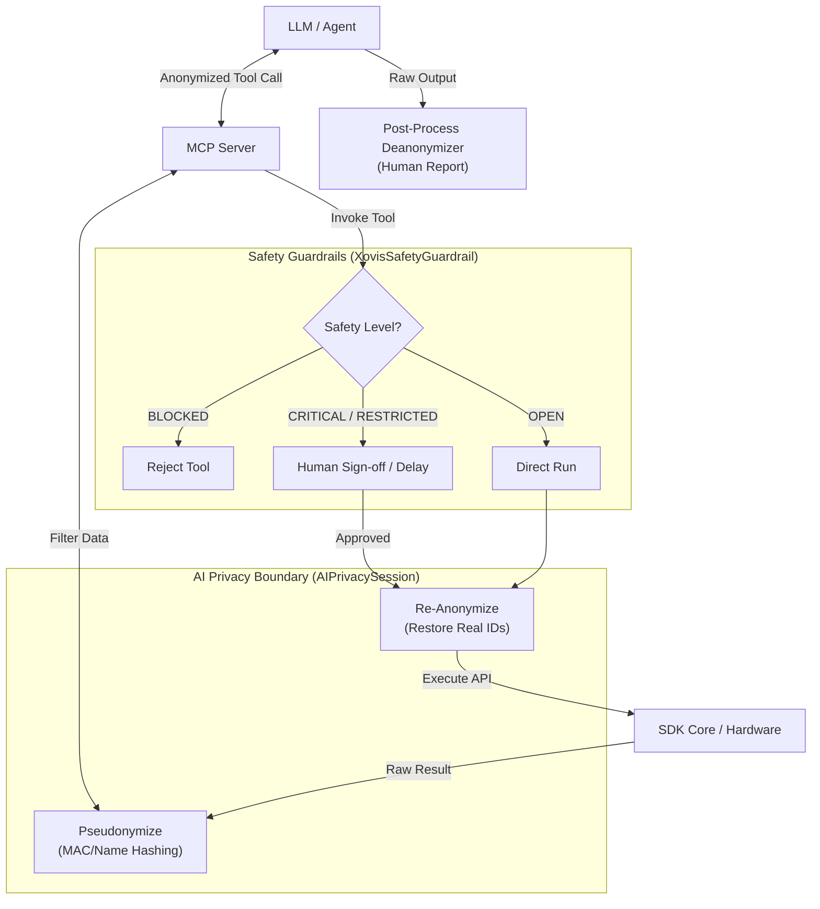

# The Agentic Layer (AI Orchestration)

The Agentic Layer is the safety-first integration layer that bridges physical device interactions with natural language execution, LLMs, and the Model Context Protocol (MCP).

## Safety-by-Design Architecture

The Model Context Protocol (MCP) server does not expose the raw SDK or REST APIs directly to AI models. Instead, it operates under a strictly defined boundary:
*   **Explicit Mapping:** Only SDK methods explicitly declared in the `_tools_map` of `XovisAIToolkit` are accessible.
*   **Safety Level Filtering:** Every tool is pre-assigned a strict `SafetyLevel` rating that dictates whether it can execute and under what conditions.

### The Four Safety Tiers

1.  **`BLOCKED` (Strictly Forbidden):** Operational actions like `flash_format` or `delete_remote_connection` are routed to placeholders, completely preventing model execution.
2.  **`CRITICAL` (Human-in-the-Loop):** Operations that can alter network profiles or reset physical configurations (e.g., `factory_reset`, `update_network_settings`) require explicit human intervention. If called without confirmation, a `PermissionError` is raised.
3.  **`RESTRICTED` (Warnings & Pacing):** Temporary disruptive actions (e.g., `reboot_device`) require the agent to inject warnings and/or respect pacing delays before firing.
4.  **`OPEN` (Read-Only & Safe Maintenance):** Operational monitoring commands like `get_system_info` and `get_topology_graph` are always safe and executable.

---

## AI Privacy Boundaries (`AIPrivacySession`)

To maintain GDPR compliance and security, the SDK implements format-preserving pseudonymization:
*   **Hash Obfuscation:** Before payloads are exposed to the LLM, sensitive identifiers such as MAC addresses, user IDs, and customer names are dynamically pseudonymized into format-preserving hashes (e.g., `Id_a1b2c3d4`).
*   **Zero-Trust Routing:** The model only ever reasons over these safe hashes.
*   **Native Re-Anonymization:** Upon returning commands, the local Python session restores the real MACs and identifiers immediately before execution.
*   **Human-Readable Reporting:** To compile legible operator reports, the wrapper script executes `toolkit.privacy_session.deanonymize_text(raw_llm_output)` natively *after* the LLM finishes generation.

---

## Agentic Layer Safety Guardrail Flow

