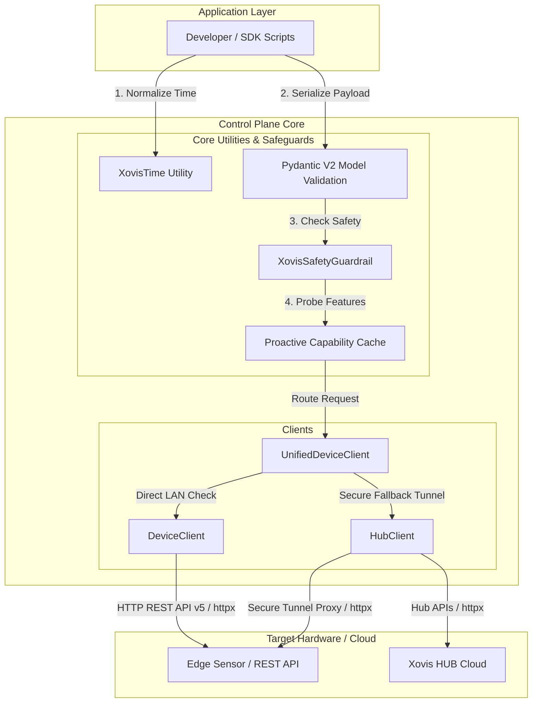

# The Control Plane (Configuration Management)

The Control Plane manages low-frequency REST API wrappers for configuring the Xovis HUB Cloud and local edge sensors.

## Unified Device Routing Layer (`UnifiedDeviceClient`)

To solve issues where the Xovis HUB does not contain real local LAN IPs (e.g., behind gateways or NAT), the SDK introduces a **Multi-Plane Hybrid Routing Strategy** via the `UnifiedDeviceClient`. 

When connecting to a device:

1.  **Local Handshake Check:** The client performs a fast TCP/HTTP probe of local IP addresses (either cached or discovered).
2.  **Direct LAN Execution:** If reachable, a direct, low-latency `DeviceClient` connection is used.
3.  **HUB Proxy Fallback:** If the local path is blocked or the device is remote, the SDK automatically falls back to spawning a secure connection routed through the Cloud HUB proxy tunnel (`HubClient.connect_device`).

---

## Control Flow and Router Diagram

---

## Core Philosophy

While the Data Plane prioritizes high throughput and zero blocking, the Control Plane prioritizes structural robustness, strict schema validation, security, and networking resilience.

*   **Rule - Robustness:** We use `httpx` for async networking, and `tenacity` for rate-limit (HTTP 429) and server-error (HTTP 50x) backoffs.
*   **Rule - Strict Pydantic CRUD:** All resource managers (Analytics, Scene, DataPush, etc.) MUST enforce strict schema validation using the auto-generated Pydantic V2 models. Never use raw `Dict[str, Any]` in method signatures for payloads.
*   **Rule - Pydantic Serialization:** When posting Pydantic models to `httpx`, you MUST use `payload = obj.model_dump(mode="json", by_alias=True, exclude_unset=True)` to ensure `Enums` and `AnyUrl` serialize correctly.
*   **Rule - Proactive Hardware Probing:** Do not rely on brittle `try...except 403/404` blocks for missing hardware features. Use the lazy, asynchronous `_probe_capability` cache (e.g., `client.has_wifi`, `client.has_analytics`) or license-aware checks (e.g. `client.has_object_detection`, `client.has_pram_detection`) to gracefully handle hardware constraints.
*   **Rule - Hub Auth0:** The Xovis Hub uses Auth0. Token requests MUST be sent as a form-encoded POST (`data={...}`, NOT `json={...}`) to `https://login.xovis.cloud/oauth/token` including the `"audience": "https://api.xovis.cloud/"` parameter. Tokens MUST be cached to disk to prevent 429 rate-limiting.
