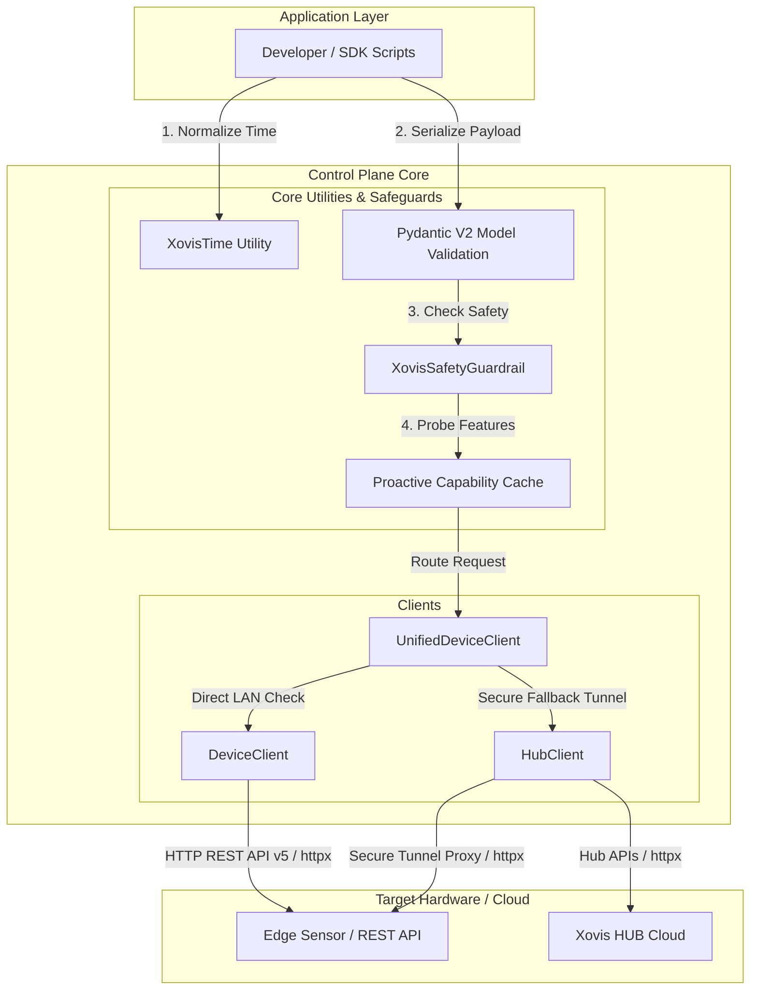

# The Control Plane (Configuration Management)

The Control Plane manages low-frequency REST API wrappers for configuring the Xovis HUB Cloud and local edge sensors.

## Unified Device Routing Layer (`UnifiedDeviceClient`)

To solve issues where the Xovis HUB does not contain real local LAN IPs (the **Gateway Proxy IP Quirk**, where the Hub proxies connections via Gateway IPs), the SDK introduces an **Intelligent MAC/IP Routing Protocol** via the `UnifiedDeviceClient`. 

When connecting to a device, the router evaluates the target and executes the following protocol:

1.  **IP Target Resolution:**
    *   **Attempt Direct Local LAN:** Immediately attempts a direct, low-latency `DeviceClient` connection on the local network.
    *   **Hub Quirk Guardrail & Fallback:** If local connection fails, it cross-references the Hub Cache to map the IP to a safe MAC address before attempting a Cloud Tunnel. It strictly prevents routing raw IPs through the Hub to avoid Gateway proxying instability.
2.  **MAC Target Resolution:**
    *   **Attempt Local LAN (Primary):** Utilizes the 3-Tier Network Discovery (ARP Cache, Proxy Sensor, etc.) to resolve a local IP for a direct LAN connection (prioritizing local traffic).
    *   **HUB Proxy Fallback (Secondary):** If local resolution fails (the device is remote), it falls back to a highly stable Hub MAC connection (`HubClient.connect_device`).

---

## Control Flow and Router Diagram

---

## Core Philosophy

While the Data Plane prioritizes high throughput and zero blocking, the Control Plane prioritizes structural robustness, strict schema validation, security, and networking resilience.

*   **Rule - Robustness:** We use `httpx` for async networking, and `tenacity` for rate-limit (HTTP 429) and server-error (HTTP 50x) backoffs.
*   **Rule - Strict Pydantic CRUD:** All resource managers (Analytics, Scene, DataPush, etc.) MUST enforce strict schema validation using the auto-generated Pydantic V2 models. Never use raw `Dict[str, Any]` in method signatures for payloads.
*   **Rule - Pydantic Serialization:** The SDK handles Pydantic serialization natively at the `XovisHTTPClient` layer. It is hardcoded to use `exclude_unset=True` and `by_alias=True` for all Pydantic models. This is a HARD RULE to prevent `PATCH` and `PUT` requests from overwriting edge configurations with unset fields.
    *   **Context-Aware Serialization:**
        *   **Standard Usage:** Pass raw Pydantic models directly to Resource Managers or the MCP Toolkit.
        *   **Internal SDK / Bypass:** The global `request` wrapper handles serialization automatically, ensuring consistent `exclude_unset=True` and `by_alias=True` behavior.
        *   **Data Plane:** NEVER use Pydantic in the hot path. Use raw `json`/`orjson`.
*   **Rule - Proactive Hardware Probing:** Do not rely on brittle `try...except` blocks for missing hardware features. Use the lazy, asynchronous `_probe_capability` cache or license-aware checks. Note that Xovis sensors return 403 HTML (mapped to `EndpointNotFoundError`) for missing/restricted endpoints.
*   **Rule - Hub Auth0:** The Xovis Hub uses Auth0 for API access. The SDK automatically manages token requests, refresh cycles, and disk persistence to prevent 429 rate-limiting. Users MUST NOT manually request or cache tokens.
