# The Data Plane (Telemetry Ingestion)

The Data Plane is designed for ultra-high-frequency (12.5Hz) ingestion of live tracking coordinates, telemetry, and binary recordings using pure native, non-blocking `asyncio`.

## Technical Architecture

### 1. Ingestion Engines

The Data Plane provides both passive and active ingestion mechanisms to accommodate different hardware output configurations:

#### Passive Receivers (Servers)
Passive servers run in the SDK's process and listen for incoming connections or packets pushed directly by Xovis sensors:

*   `XovisTCPServer`: Listens on a configured port for persistent TCP streams pushed by the sensor (Client mode).
*   `XovisUDPServer`: Handles native incoming `asyncio.DatagramProtocol` packets.
*   `XovisHTTPServer`: Ingests POST requests from HTTP Webhooks configured on the hardware.

#### Active Receivers (Clients)
Active clients initiate connections and subscribe to streams, allowing the SDK to pull or consume telemetry from remote brokers or sensors:

*   `XovisTCPClient`: Establishes a persistent TCP connection to a Xovis sensor configured in SERVER mode (typically ports 49156/49159) and extracts stream data.
*   `XovisMQTTClient`: Connects to an external MQTT broker, subscribes to the designated telemetry topics, and consumes published messages asynchronously.

### 2. Stream Processing Mechanics

*   **Sliding Buffer Extraction:** For continuous streaming protocols over TCP (both `XovisTCPServer` and `XovisTCPClient`), the incoming bytes are placed into a sliding string buffer. Because Xovis streaming telemetry contains concatenated JSON frames without newlines or length prefixes, the parser iteratively applies `json.JSONDecoder().raw_decode()` to peel valid JSON frames off the buffer.
*   **Discrete Message Processing:** For message or packet-oriented protocols (`XovisUDPServer`, `XovisHTTPServer`, and `XovisMQTTClient`), the payloads are already delineated. These utilize `orjson.loads()` via the central `DataPlaneIngestor.parse_frame` helper to achieve extremely fast, zero-copy lock-free deserialization.
*   **Heartbeat Filtering:** The ingestor identifies connection/test heartbeats and filters them out, preventing downstream sinks from being polluted with diagnostic noise.
*   **Binary Fallback Wrapping:** Non-JSON payloads (e.g., binary recordings) are automatically caught and wrapped inside a standardized `recording_data` JSON-compatible schema to maintain downstream compatibility.

---

## Ingestion Pipeline Flowchart

```mermaid
graph TD
    %% Streaming TCP Pipeline
    subgraph Streaming ["A. Continuous TCP Streaming (Byte Stream)"]
        direction LR
        SrcTCP["TCP Source<br/>(Push/Poll)"] --> EngTCP["TCP Engine<br/>(Server/Client)"]
        EngTCP --> Buffer["Sliding String Buffer"]
        Buffer --> RawDecode["json.raw_decode()"]
    end

    %% Discrete Message Pipeline
    subgraph Discrete ["B. Discrete Messaging (Packet-oriented)"]
        direction LR
        SrcDisc["UDP/HTTP/MQTT Source<br/>(Packets/Messages)"] --> EngDisc["Message Engine<br/>(UDP/HTTP/MQTT)"]
        EngDisc --> Orjson["orjson.loads()"]
    end

    %% Fallback / Dispatch
    subgraph Dispatch ["C. Filtering & Dispatch (Central Ingestor)"]
        direction TB
        RawDecode --> Filter{"Heartbeat Check?"}
        Orjson --> Filter
        
        Filter -->|"No (Valid Frame)"| Sink["XovisSink Protocol"]
        Filter -->|"Yes (Diagnostic)"| Ignore["Ignore / Filter Out"]
        
        Binary["Non-JSON / Binary Payload"] -->|"Binary Wrap Fallback"| Sink
    end

    style Streaming fill:#0f172a,stroke:#38bdf8,stroke-width:1px
    style Discrete fill:#0f172a,stroke:#2dd4bf,stroke-width:1px
    style Dispatch fill:#1e293b,stroke:#818cf8,stroke-width:1px
```

---

## Core Philosophy

To support real-time applications such as queue management, path tracking, and live density analysis, telemetry ingestion must remain completely unblocked by configuration operations or cloud connectivity latency.

*   **Rule - Absolute Throughput:** We use pure native `asyncio` (enhanced by `uvloop` on Linux/macOS or `WindowsProactorEventLoopPolicy` on Windows) for zero-blocking socket management.
*   **Rule - The Parsing Quirk:** Xovis TCP streams (`LIVE_DATA`) send raw, concatenated JSON without newlines or length prefixes. You MUST use a sliding string buffer combined with standard library `json.JSONDecoder().raw_decode()` to extract frames safely. Do NOT use `orjson` for this specific extraction step.
*   **Rule - Zero-Copy / Data Handling:** STRICTLY NO `pydantic` validation in this hot path. Telemetry data must be instantly forwarded to the attached sinks to ensure zero-blocking of the high-frequency ingestion stream.
*   **Rule - Efficient Sinks:** Downstream handoffs MUST utilize batched delivery mechanisms where applicable to minimize network round-trips and maintain high throughput.
