# The State & Topology Plane (Fleet Orchestration)

The State & Topology Plane acts as the stateful, topology-aware "Fleet Engine" of the `xovis-sdk`. It abstracts physical sensors, lens topologies, and virtual multisensor clusters into highly organized, accessible structures.

## Interaction: Topology, Cache, and StateBucket

To build robust, offline-first fleet management, the SDK separates structural relationships from the configurations themselves. This is achieved through the coordinated interplay of **Topology**, **Cache**, **Buckets**, and **Managers**.

### Demystifying the Terms

To navigate the State & Topology Plane with confidence, it helps to understand these four core concepts:

1.  **Topology (The Floorplan / Blueprint):** This is the logical and physical map of your network and hardware. It defines which physical sensors (`singlesensor`) and virtual stitched environments (`multisensors`) actually exist. It does not contain configuration data; it only defines the *structure* of what can be configured (like physical rack layouts and loading zones).
2.  **Bucket (The Shipping Pallets / Crates):** A **StateBucket** (e.g., `HostStateBucket` or `ContextStateBucket`) is a raw, behaviorless data container. It holds JSON-serialized lists of resources (zones, lines, agents, connections) belonging to a specific context. It is the structured "cargo" or contents stored in a specific compartment.
3.  **Cache (The Warehouse):** This is the localized storage repository (the in-memory state mapping and the persisted `device_state.json` file) where all state buckets are stored. It acts as the offline-first single source of truth for the SDK, indexing and holding all assets.
4.  **Manager (The Warehouse Operator):** The active orchestrator (specifically `ConfigCacheManager` or `HubCacheManager`) that manages the lifecycle of the cache. It executes the synchronization loops (`sync`), schedules background updates, handles disk serialization via non-blocking threads, and exposes intuitive dot-notation `REPLAccessor` layers.

---

### The Core Workflow

1.  **Topology Discovery:** The `client.topology` manager identifies which contexts exist. It discovers if the sensor is a standalone device (`singlesensor`) or part of a stitched `multisensor` cluster.
2.  **Cache Synchronization:** When you call `await client.cache.sync()`, the SDK queries the topology map to find all active physical and virtual context endpoints, fetches their configurations, and populates the localized Cache.
3.  **StateBucket Storage:** For every context identified in the topology, the SDK isolates and populates a localized `StateBucket` within the Cache containing the specific zones, lines, and agents belonging to that context.

```mermaid
graph TD
    %% Class Definitions for Premium Styling
    classDef client fill:#0f172a,stroke:#2dd4bf,stroke-width:2px,color:#f8fafc;
    classDef network fill:#1e293b,stroke:#38bdf8,stroke-width:2px,color:#f8fafc;
    classDef buckets fill:#1e1b4b,stroke:#818cf8,stroke-width:2px,color:#f8fafc;
    classDef cache fill:#111827,stroke:#eab308,stroke-width:2px,color:#f8fafc;

    subgraph DeviceClient [Device Client Instance]
        T["<b>Topology Manager</b><br/><i>The Map</i>"]:::client
        C["<b>Config Cache Manager</b><br/><i>The Orchestrator</i>"]:::client
    end

    subgraph Network [LAN & Remote Network]
        L["<b>Physical Lens</b>"]:::network
        MS["<b>Multisensor Cluster</b>"]:::network
    end

    T -- "Scans & Discovers" --> Network
    C <-- "Uses Map from" --> T

    subgraph Buckets [State Buckets / Contexts]
        SB1["<b>Bucket: singlesensor</b><br/>Zones, Lines, Agents"]:::buckets
        SB2["<b>Bucket: multisensor_1</b><br/>Multisensor Zones, Logics"]:::buckets
    end

    C -- "Populates & Manages" --> Buckets

    SB1 -- "Represents Data for" --> L
    SB2 -- "Represents Data for" --> MS

    %% 3-Tier Cache System (Disk/System/Memory)
    subgraph DiskStorage ["3-Tier Caching System"]
        Tier1["<b>Tier 1: Local Workspace</b><br/>_local_resources/states/"]:::cache
        Tier2["<b>Tier 2: System Cache</b><br/>~/.cache/xovis/"]:::cache
        Tier3["<b>Tier 3: Memory Fallback</b><br/>RAM Only"]:::cache
    end

    C -- "Persists to" --> DiskStorage

    %% Styling Overrides
    style DeviceClient fill:#0f172a,stroke:#2dd4bf,stroke-dasharray: 5 5
    style Network fill:#0f172a,stroke:#38bdf8,stroke-dasharray: 5 5
    style Buckets fill:#111827,stroke:#818cf8,stroke-dasharray: 5 5
    style DiskStorage fill:#111827,stroke:#eab308,stroke-dasharray: 5 5
```



When you execute `client.cache.export_to_file("device_state.json")`, the SDK aggregates all localized `StateBuckets` structured by the `TopologyManager` and dumps them into a single, cohesive offline state JSON file.

### Component Responsibilities

| Component    | Responsibility | Technical Definition | Analogy |
|:-------------| :--- | :--- | :--- |
| **Topology** | **Structural Logic**: Discovers active network hosts, lens clusters, and synthesizes multisensor graphs. | `TopologyManager` | The **Floorplan / Aisles Layout** of the warehouse. |
| **Managers** | **Life-cycle Management**: Active executor running sync loops, background watchers, and disk serialization. | `ConfigCacheManager` / `HubCacheManager` | The **Warehouse Operator / Dispatcher** managing inventory flow. |
| **Cache**    | **State Repository**: The in-memory collection and serialized files representing the offline-first state of the fleet. | Local state cache dictionary / `device_state.json` | The **Warehouse** itself where all assets are stored and indexed. |
| **Buckets**  | **Data Container**: Isolated Pydantic models containing serialized zones, lines, and agents for a context. | `HostStateBucket` / `ContextStateBucket` | The **Shipping Pallets / Crates** holding specific grouped cargo. |

---

## Multisensor Topology & Caching Lifecycle

The `xovis-sdk` features specialized, high-performance lifecycle handlers for multisensor network clusters and topology configurations:

*   **Auto-Discovery via Synchronization:** Upon calling `await client.cache.sync()` or invoking `HardwareSyncer.warmup()`, the `ConfigCacheManager` queries `/api/v5/multisensors/status`. This endpoint identifies whether the connected device is a master or a member of a virtual multisensor context.
*   **Concurrent Config Ingestion:** If a multisensor topology is discovered, the manager concurrently retrieves and builds the structured model representing parent/child zones, lines, analytics states, and scene definitions in a single non-blocking pass.
*   **Dynamic Child-Client Spawning:** Developers can invoke `await context.get_child_clients()` on a `MultisensorContext`. This queries `/api/v5/multisensors/{id}/sensors` and dynamically spawns authenticated, matching `DeviceClient` instances for all physical child sensors, inheriting authentication credentials, SSL certificates, and proxy tunnel settings.
*   **Autonomous Watcher Synchronization:** Under the `BACKGROUND_WATCHER` caching strategy, the SDK continuously monitors the device checksum endpoints. When configuration or topology changes are detected on the physical sensor, a background synchronization loop triggers automatically to keep the cache updated on disk.
*   **Optional Recursive Child Caching:** By default, child-device caching is deactivated to prevent unexpected network overhead. Developers can opt-in to recursively synchronize all physical child sensor configurations concurrently using the `cache_child_devices=True` flag:
    ```python
    client = DeviceClient("192.168.1.50", cache_child_devices=True)
    await client.cache.sync()  # Recursively synchronizes child configurations
    ```
*   **Dynamic Child Client Access (`child_devices`):** Access physical child devices directly through the parent context. Individual child clients are dynamically registered, enabling dot-notation or dictionary-like lookup under `.child_devices.by_name`:
    ```python
    child_client = client.cache.multisensors.by_name.Stitched_Context.child_devices.by_name.Camera_Left
    ```
*   **Merged Child Configurations:** Merged properties (`connections`, `zones`, `lines`, `agents`, `logics`, `modifiers`, `counters`, `masks`, `layers`) automatically aggregate and flatten the configurations from all child caches into a single autocomplete-safe `CacheCollection`:
    ```python
    # Access a connection belonging to any child device
    conn = client.cache.multisensors.by_name.Stitched_Context.child_devices.connections.by_name.my_child_connection
    ```
*   **Concurrent Group Broadcasting:** Intercept and broadcast standard live operations (e.g., `.images`, `.system`, `.analytics`) concurrently to all child sensors in a single call with isolated error handling in `BulkResult`:
    ```python
    # Captures live diagnostic frames across all child cameras concurrently
    bulk_results = await client.cache.multisensors.by_name.Stitched_Context.child_devices.images.get_live()
    ```
*   **Offline-First Child Cache State Access (`child_caches`):** Inspect child caches without network requests:
    ```python
    # Reads offline zone configuration from a physical child sensor
    child_zone = client.cache.multisensors.by_name.Stitched_Context.child_caches.Camera_Left.zones.by_name.Raw_Zone_1
    ```
*   **Dynamic Space Sanitization:** Xovis names often include spaces (e.g., `"Main Entrance"`). The SDK automatically sanitizes these into valid Python identifiers (`Main_Entrance`) for perfect IDE auto-suggestions, while retaining original names for bracket-style lookups (`["Main Entrance"]`).

---

## Core Philosophy

A standard sensor is more than just a single IP address—it represents an entire network topology of physical sensors, stitched virtual environments, and configuration buckets. This plane manages these relationships seamlessly.

*   **Rule - Context Isolation:** A device IP is a "Host". A host runs isolated "Contexts". The `singlesensor` context applies strictly to physical lenses (and MUST gracefully raise `HardwareNotSupportedError` if the host is a lensless Spider NUC). The `multisensors` context applies to 0..N virtual stitched environments. Geometries and DataPushes are strictly partitioned by context.
*   **Rule - Multisensor Cache Rooting:** Virtual contexts discovered via `multisensors.sync()` MUST be rooted into the persistent `HostStateBucket` via the `@multisensors.setter`. This ensures that DataPush agents and connections persist across CRUD operations and are visible to the `REPLAccessor`.
*   **Rule - String-Normalized Resolution:** All resource managers MUST normalize context and resource IDs to strings when interacting with the stateful cache. Integer keys are strictly forbidden in the `multisensors` mapping to prevent resolution failures.
*   **Rule - Proactive Context Discovery:** Resource managers SHOULD trigger a proactive `multisensors.sync()` if a targeted virtual context is missing from the local cache, enabling on-the-fly recovery of hardware state.
*   **Rule - Hardware-Aware Context Routing:** Agents MUST call `get_system_info` as a mandatory prerequisite to identify the hardware type (Spider vs. PC/PF series). Spider NUCs lack a physical lens and will reject `singlesensor` requests. `SinglesensorContext.datapush` must raise `HardwareNotSupportedError` on lensless hardware.
*   **Rule - Smart Caching & GC Trap:** The SDK uses a `ConfigCacheManager` (Device) and `HubCacheManager` (Hub, with client-side `fleet_filter` mapping). **CRITICAL:** If `BACKGROUND_WATCHER` is active, the `asyncio.create_task` loop MUST be stored in a hard-referenced `Set` (to prevent Python 3.11+ GC mid-execution) and cleanly cancelled in `__aexit__`.
*   **Rule - Offline-First Persistence:** The `ConfigCacheManager` supports auto-persistence via `auto_persist_path`. Disk serialization/deserialization MUST be offloaded using `asyncio.to_thread` to ensure zero blocking of the async event loop.
*   **Rule - Edge Topology Synthesis:** The `TopologyManager` synthesizes directed graphs (`MSGraph`) by concurrently cross-referencing multisensor child clusters with physical local network nodes.
*   **Rule - Multisensor Discovery Synthesis (Top-Down Only):** Discovery MUST be synthesized Top-Down. Children are "ignorant" and return fake standalone status. You MUST scan all local nodes (`/discover/localnetwork`), query their `/multisensors/status`, and correlate `sensors[].mac_address` lists from Master nodes (where `enabled: true`) to build the hierarchy.
