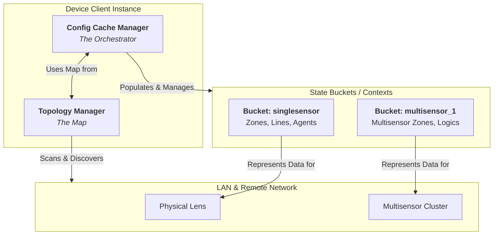

# The State & Topology Plane (Fleet Orchestration)

The State & Topology Plane acts as the stateful, topology-aware "Fleet Engine" of the `xovis-sdk`. It abstracts physical sensors, lens topologies, and virtual multisensor clusters into highly organized, accessible structures.

## Interaction: Topology, Cache, and StateBucket

To build robust, offline-first fleet management, the SDK separates structural relationships from the configurations themselves. This is achieved through the coordinated interplay of **Topology**, **Cache**, **Buckets**, and **Managers**.

### Demystifying the Terms

To navigate the State & Topology Plane with confidence, it helps to understand these four core concepts:

1.  **Topology (The Blueprint):** This is the logical and physical map of your network and hardware. It defines which physical lenses (`singlesensor`) and virtual stitched clusters (`multisensors`) actually exist. It does not contain configuration data; it only defines the *structure* of what can be configured.
2.  **Bucket (The Cargo):** A **StateBucket** (e.g., `HostStateBucket` or `ContextStateBucket`) is a raw, behaviorless data container. It holds JSON-serialized lists of resources (zones, lines, agents, connections) belonging to a specific context. It is the "payload" or content itself.
3.  **Cache (The Warehouse):** This is the localized storage repository (the in-memory state mapping and the persisted `device_state.json` file) where all state buckets are stored. It acts as the offline-first single source of truth for the SDK.
4.  **Manager (The Operator):** The active orchestrator (specifically `ConfigCacheManager` or `HubCacheManager`) that manages the lifecycle of the cache. It executes the synchronization loops (`sync`), schedules background updates, handles disk serialization via non-blocking threads, and exposes intuitive dot-notation `REPLAccessor` layers.

---

### The Core Workflow

1.  **Topology Discovery:** The `client.topology` manager identifies which contexts exist. It discovers if the sensor is a standalone device (`singlesensor`) or part of a stitched `multisensor` cluster.
2.  **Cache Synchronization:** When you call `await client.cache.sync()`, the SDK queries the topology map to find all active physical and virtual context endpoints, fetches their configurations, and populates the localized Cache.
3.  **StateBucket Storage:** For every context identified in the topology, the SDK isolates and populates a localized `StateBucket` within the Cache containing the specific zones, lines, and agents belonging to that context.

When you execute `client.cache.export_to_file("device_state.json")`, the SDK aggregates all localized `StateBuckets` structured by the `TopologyManager` and dumps them into a single, cohesive offline state JSON file.

### Component Responsibilities

| Component    | Responsibility | Technical Definition | Analogy |
|:-------------| :--- | :--- | :--- |
| **Topology** | **Structural Logic**: Discovers active network hosts, lens clusters, and synthesizes multisensor graphs. | `TopologyManager` | The **Blueprint** of a building. |
| **Managers** | **Life-cycle Management**: Active executor running sync loops, background watchers, and disk serialization. | `ConfigCacheManager` / `HubCacheManager` | The **Building Manager / Operator** who keeps everything running. |
| **Cache**    | **State Repository**: The in-memory collection and serialized files representing the offline-first state of the fleet. | Local state cache dictionary / `device_state.json` | The **Warehouse** where all assets are stored and indexed. |
| **Buckets**  | **Data Container**: Isolated Pydantic models containing serialized zones, lines, and agents for a context. | `HostStateBucket` / `ContextStateBucket` | The **Furniture and People** inside a specific room. |

---

## Core Philosophy

A standard sensor is more than just a single IP address—it represents an entire network topology of physical lenses, stitched virtual environments, and configuration buckets. This plane manages these relationships seamlessly.

*   **Rule - Context Isolation:** A device IP is a "Host". A host runs isolated "Contexts". The `singlesensor` context applies strictly to the physical lens (and MUST gracefully raise `HardwareNotSupportedError` if the host is a lensless Spider NUC). The `multisensors` context applies to 0..N virtual stitched environments. Geometries and DataPushes are strictly partitioned by context.
*   **Rule - Multisensor Cache Rooting:** Virtual contexts discovered via `multisensors.sync()` MUST be rooted into the persistent `HostStateBucket` via the `@multisensors.setter`. This ensures that DataPush agents and connections persist across CRUD operations and are visible to the `REPLAccessor`.
*   **Rule - String-Normalized Resolution:** All resource managers MUST normalize context and resource IDs to strings when interacting with the stateful cache. Integer keys are strictly forbidden in the `multisensors` mapping to prevent resolution failures.
*   **Rule - Proactive Context Discovery:** Resource managers SHOULD trigger a proactive `multisensors.sync()` if a targeted virtual context is missing from the local cache, enabling on-the-fly recovery of hardware state.
*   **Rule - Hardware-Aware Context Routing:** Agents MUST call `get_system_info` as a mandatory prerequisite to identify the hardware type (Spider vs. PC/PF series). Spider NUCs lack a physical lens and will reject `singlesensor` requests. `SinglesensorContext.datapush` must raise `HardwareNotSupportedError` on lensless hardware.
*   **Rule - Smart Caching & GC Trap:** The SDK uses a `ConfigCacheManager` (Device) and `HubCacheManager` (Hub, with client-side `fleet_filter` mapping). **CRITICAL:** If `BACKGROUND_WATCHER` is active, the `asyncio.create_task` loop MUST be stored in a hard-referenced `Set` (to prevent Python 3.11+ GC mid-execution) and cleanly cancelled in `__aexit__`.
*   **Rule - Offline-First Persistence:** The `ConfigCacheManager` supports auto-persistence via `auto_persist_path`. Disk serialization/deserialization MUST be offloaded using `asyncio.to_thread` to ensure zero blocking of the async event loop.
*   **Rule - Edge Topology Synthesis:** The `TopologyManager` synthesizes directed graphs (`MSGraph`) by concurrently cross-referencing multisensor child clusters with physical local network nodes.
*   **Rule - Multisensor Discovery Fallbacks:** Global status endpoints (e.g., `/multisensors/status`) may fail on restrictive hardware. Discovery logic MUST fallback to probing explicit IDs (e.g., 1, 2, 3) to ensure context isolation.
