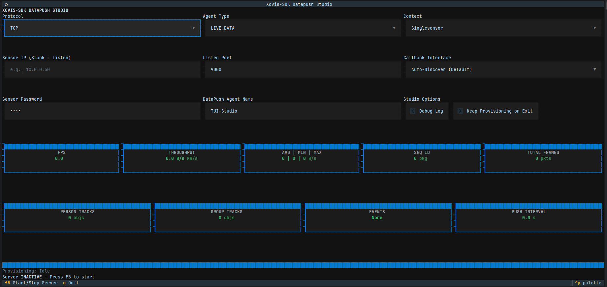

# Command Line Interface

The `xovis-sdk` includes a powerful CLI for offline type generation and documentation compliance checks.

## Usage

```bash
xovis-cli [COMMAND] [OPTIONS]
```

## Commands

### `warmup`
Synchronizes proprietary resources from a physical Xovis sensor to the local environment.

**What it does:**

- Downloads the **OpenAPI schema** into `_local_resources/schemas/{fw_version}/api.yaml` (e.g., `_local_resources/schemas/5-9-2/api.yaml`).
- Exports the current **Host State** (MACs, names, capabilities) to `_local_resources/states/` (`device_state.json` and `state_{ip}.json`).
- Populates structured directories under `_local_resources/` for offline use by the SDK and AI agents (`schemas/{fw_version}/`, `schemas/hub/`, `states/`, `samples/`).

**Options:**

- `host`: (Positional) IP address of the sensor.
- `--user`: Username (default: `admin`).
- `--pass`: Password (default: `pass`).
- `--force`: Overwrite existing local schemas.

### `warmup-hub`
[HUB] Performs a Cloud-level synchronization to fetch fleet-wide resources.

**What it does:**

- Downloads the **HUB OpenAPI schemas** (Devices, Licenses).
- Exports the entire **Hub Fleet State** to a local persistence file.
- Enables AI agents to reason about the fleet without constant cloud round-trips.

**Options:**

- `--client-id`: HUB OAuth2 Client ID.
- `--client-secret`: HUB OAuth2 Client Secret.
- `--force`: Overwrite existing local schemas.

### `generate-types`
Parses an offline `HostStateBucket` cache and generates strict Python `Literal` types for IDE autocompletion.

**Options:**

- `--source`: Path to the cache JSON (auto-detected; prioritizes `_local_resources/states/` and falls back to `device_state.json`).
- `--output`: Target Python file path.
- `--device`: Unified target argument accepting an IP or MAC address. Replaces `--host` and `--hub-device`.
- `--via-hub`: Optional boolean flag to explicitly route the connection through the Xovis Hub Cloud tunnel.
- `--dry-run`: Analyze without writing to disk.

### `probe`
Quick hardware status check. Retrieves model, MAC, firmware, and operational status.

### `sync-models`
Syncs Pydantic models from a physical device for a specific version tag (e.g., `v5_9_2`).

### `mcp`
Launches the Xovis MCP Server for integration with Claude Desktop, Cursor, and Windsurf.
- `--log-file <path>`: Optional path to a log file for the MCP Server.
- `--daemon`: Start the MCP Server in the background as a daemon.
- `--tool-limit <limit>`: Optional limit for the number of tools exposed (default: 90, 0 to disable).

### `hub`
Orchestrates Xovis HUB Cloud fleet operations (e.g., `list-devices`).

### `discovery`
Internal tool to analyze firmware drift and identify unknown API fields via agentic semantic analysis.

### `setup`
Launches the guided SDK setup wizard for initial configuration.

### `ui`
Launches the **Xovis Mission Control TUI**, the primary visual interface for SDK orchestration.

**Core Capabilities:**

- **Interactive Device Discovery**: Scan local networks and Cloud HUB fleets to identify active sensors.
- **State Bucket Management**: Select multiple sensors and group them into named `HostStateBucket` instances. These buckets are persisted locally and serve as the primary configuration source for the SDK.
- **Topology Detection**: Visually verify and generate topology graphs for multisensor environments.
- **Localized Caching**: Automatically manages state and resource caches for selected devices to ensure offline-first performance.
- **AI Scope Control**: Toggle the "AI Security" whitelist (`ctrl+a`) to restrict which devices are visible to autonomous agents.

### `datapush` (alias: `studio`)
Launches the interactive **Datapush Studio TUI** to monitor DataPush stream throughput and frame integrity. This tool supports autonomous sensor provisioning directly from the UI for TCP, UDP, and HTTP protocols.


Figure: Xovis-SDK Datapush Studio Screen.

**Options:**

- `--port`: Listen port (default: 9000).
- `--protocol`: Transport protocol (`TCP`, `UDP`, or `HTTP`).
- `--agent-type`: The type of DataPush agent to provision (default: `LIVE_DATA`).
- `--pass`: Password (default: `pass`).
- `--host`: Optional: Sensor IP for auto-provisioning.

### `generate-rules`
Generates a `.cursorrules` file to guide AI agents in respecting the SDK's quadrifurcated architecture.

### `docs`
SDK documentation management commands.

**Subcommands:**

- `check-docstrings`: Scans the codebase for "Max-Docstring" compliance, ensuring all public methods have Google-style docstrings (The Receipt).
- `serve`: Scans, builds, and serves the local SDK Markdown documentation.

---

::: xovis.cli
    options:
      show_root_heading: false
      show_source: true
